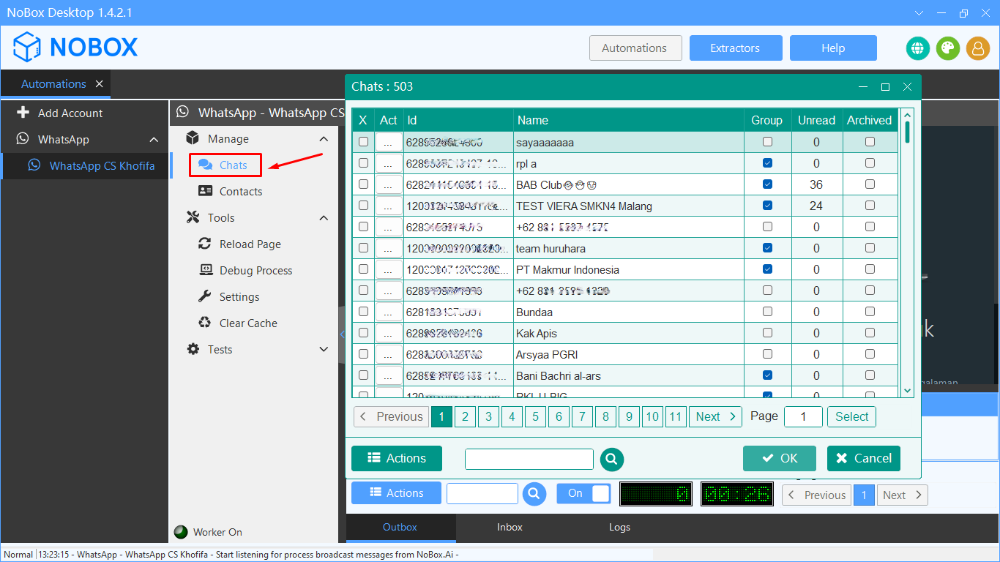
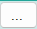
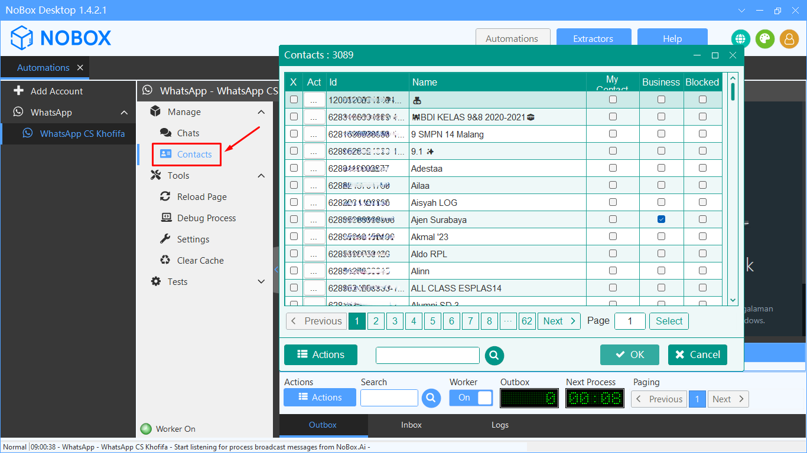
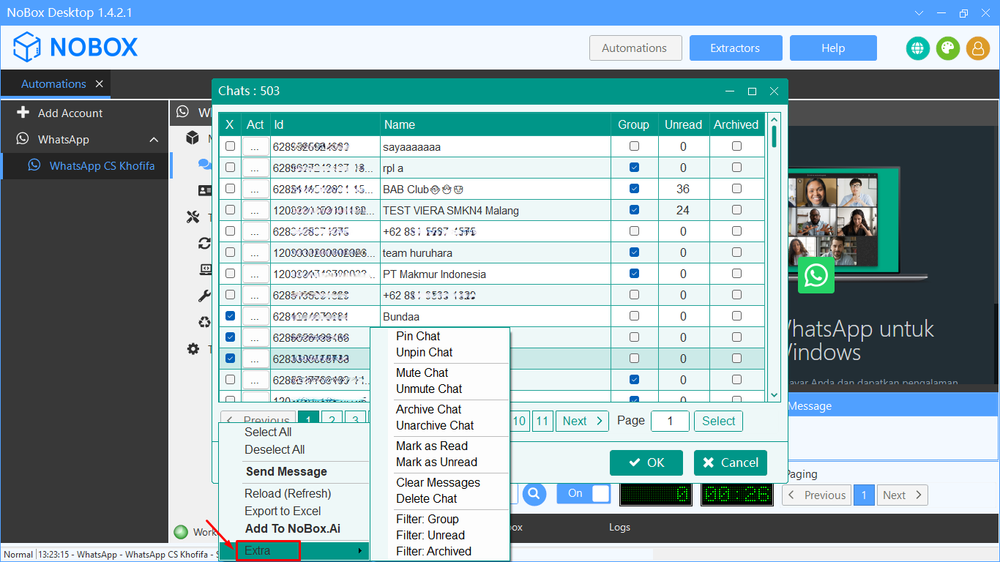
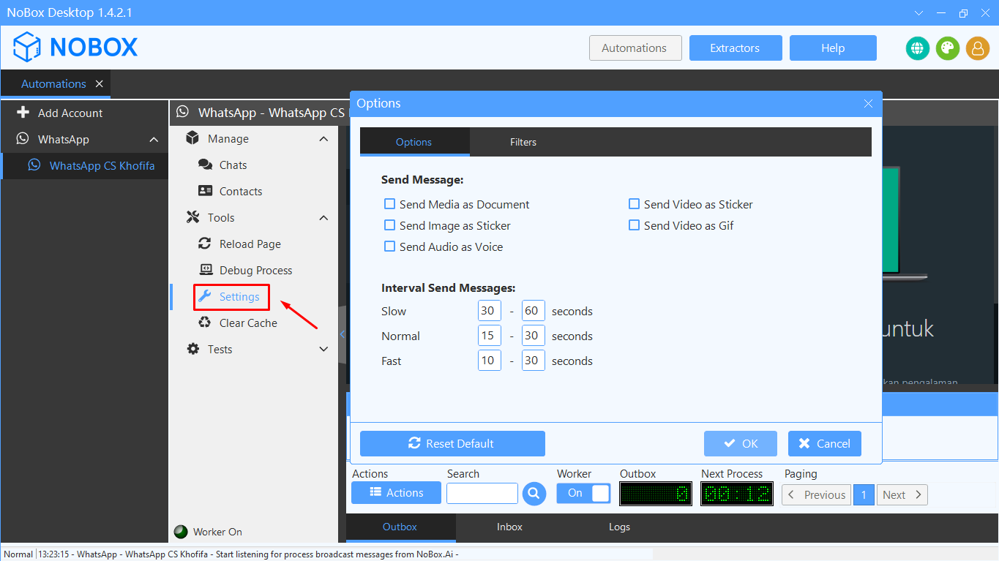
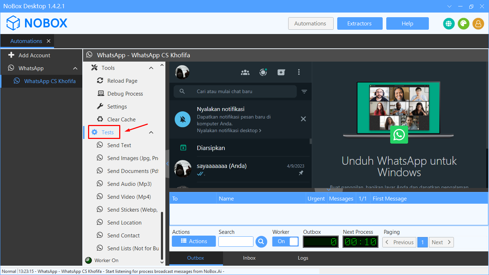

# Feature

Terdapat beberapa fitur pada menu Automation NoBox Desktop. Diantaranya sebagai berikut :

<iframe width="742" height="418" src="https://www.youtube.com/embed/xhIlIABO3SQ/" title="01. Instalasi NoBox Desktop" frameborder="0" allow="accelerometer; autoplay; clipboard-write; encrypted-media; gyroscope; picture-in-picture; web-share" referrerpolicy="strict-origin-when-cross-origin" allowfullscreen></iframe>

## **Manage Chat**

Manage chat adalah fitur yang berfungsi untuk menampilkan semua data pesan akun Anda.

<figure><figcaption></figcaption></figure>

<table><thead><tr><th width="166.5999755859375">Kolom</th><th>Uraian</th></tr></thead><tbody><tr><td>Act</td><td>Tombol untuk melakukan beberapa aksi tertentu seperti ( send message, open chat window, dan extra)</td></tr><tr><td>Name</td><td>Nama kontak akun Anda</td></tr><tr><td>Type</td><td>Tipe grup yang Anda ikuti ( Chat, channel, dsb ).</td></tr><tr><td>Participants Count </td><td>Jumlah anggota grup</td></tr><tr><td>Username</td><td>Username grup</td></tr></tbody></table>

## **Get Group Members**

Fitur ini digunakan untuk ekstrak data kontak anggota grup atau channel pada akun Anda ke NoBox.Ai dengan cara berikut :

1\. Klik menu **\[Chats]**, maka akan tampil list chat pada akun Anda dan pilih grup atau channel.

2\. Klik  pilih **\[Get Group Members]** dan pilih anggota yang akan ditambahkan ke NoBox.Ai

<figure><figcaption></figcaption></figure>

3\. Klik tombol **\[Actions] ➔ \[Add to NoBox.Ai]**, pilih target list dan klik **\[OK]**

4\. Tunggu sampai proses selesai, maka akan tampil dialog informasi jika proses sudah selesai.

5\. Data tersebut juga bisa Anda cek melalui menu **\[Contacts]** pada NoBox.Ai dengan memfilter data sesuai list yang ada pilih sebelumnya.

6\. Maka akan tampil list kontak yang telah ditambahkan.

## **Manage Contact**

Manage contact adalah fitur ini digunakan untuk memeriksa nomor kontak Telegram yang terhubung dengan Anda.

<figure><figcaption></figcaption></figure>

<table><thead><tr><th width="133">Kolom</th><th>Uraian</th></tr></thead><tbody><tr><td>Action</td><td>Tombol yang difungsikan untuk melakukan beberapa aksi tertentu</td></tr><tr><td>Name</td><td>Nama kontak akun Anda</td></tr><tr><td>MyContact</td><td>Tanda centang untuk menandai bahwa nomor tersebut berada di kontak Anda atau tidak</td></tr><tr><td>Username</td><td>Username masing-masing kontak telegram</td></tr><tr><td>Phone </td><td>No telepon telegram</td></tr></tbody></table>

## **Add Contact Chat to Nobox.Ai**

Fitur ini digunakan untuk menyimpan data kontak pada akun Anda ke NoBox.Ai dengan cara berikut :

1\. Klik menu **\[Chat]** atau **\[Contacts]**, maka akan tampil list chat atau kontak pada akun Anda dan pilih kontak atau chat yang akan Anda tambahkan ke NoBox.Ai

2\. Klik tombol **\[Actions] ➔ \[Add to NoBox.Ai]**, pilih target list dan klik **\[OK]**

<figure><figcaption></figcaption></figure>

3\. Tunggu sampai proses selesai, maka akan tampil dialog informasi jika proses sudah selesai.

4\. Data tersebut juga bisa Anda cek melalui menu **\[Contacts]** pada NoBox.Ai dengan memfilter data sesuai list yang ada pilih sebelumnya.

5\. Maka akan tampil list kontak yang telah ditambahkan.

## **Contact Export to Excel**

Fitur ini digunakan untuk menyimpan data kontak dengan fomat Excel (.xls, .csv) dengan cara berikut :

\- Klik menu **\[Chats]** atau **\[Contact] ➔ \[Actions] ➔ \[Export to Excel]** maka kontak yang dipilih akan tersimpan.

<figure><figcaption></figcaption></figure>

## **Extra**

Fitur tambahan yang digunakan untuk pin chat, unpin chat, filter chat dan sebagainya.

<figure><figcaption></figcaption></figure>

## **Tools Reload Page**

Tools Reload Page adalah fitur yang digunakan untuk memuat ulang tampilan Telegram.

<figure><figcaption></figcaption></figure>

## **Tools Debug Process**

Tools Debug Process adalah fitur yang digunakan untuk memunculkan logs detail aktivitas.

<figure><figcaption></figcaption></figure>

## **Tools Setting**

Tools Setting, didalam fitur ini ada beberapa pilihan untuk memilih tipe pesan yang akan dikirim dan **I**nterval Send Messages yang berfungsi untuk pengaturan waktu pengiriman pesan 1 ke pesan lainnya untuk menghindari pemblokiran.

<figure><figcaption></figcaption></figure>

<table><thead><tr><th width="164.20001220703125">Fitur</th><th>Uraian</th></tr></thead><tbody><tr><td>Send Message</td><td>Pilih untuk tipe pesan yang akan dikirim</td></tr><tr><td>Interval Send Messages</td><td>Atur waktu pengiriman pesan 1 kepesan lainnya untuk menghindari pemblokiran.</td></tr></tbody></table>

## **Clear Cache**

Tools Clear Cache adalah fitur yang digunakan untuk menghapus cache browser.

<figure><figcaption></figcaption></figure>

## **Test**

Test adalah fitur yang digunakan untuk mengetest pengiriman file yang Anda butuhkan.

<figure><figcaption></figcaption></figure>

<table><thead><tr><th width="145.79998779296875">Fitur</th><th>Uraian</th></tr></thead><tbody><tr><td>Send Text</td><td>Fitur test untuk mengirim pesan berupa teks</td></tr><tr><td>Send Images </td><td>Fitur test untuk mengirim pesan berupa gambar dengan format Jpg atau Png</td></tr><tr><td>Send Documents</td><td>Fitur test untuk mengirim pesan berupa dokumen berupa pdf dan lain - lain</td></tr><tr><td>Send Audio</td><td>Fitur test untuk mengirim pesan berupa audio</td></tr><tr><td>Send Video</td><td>Fitur test untuk mengirim pesan berupa video</td></tr><tr><td>Send Stickers</td><td>Fitur test untuk mengirim pesan berupa stiker dengan format Webp dan Png</td></tr><tr><td>Send Location</td><td>Fitur test untuk mengirim pesan berupa lokasi Anda</td></tr><tr><td>Send Contact</td><td>Fitur test untuk mengirim pesan berupa kontak</td></tr><tr><td>Send Lists</td><td>Fitur test untuk mengirim pesan berupa file lainnya</td></tr></tbody></table>

---

Jika ada masalah atau kesulitan terkait NoBox Desktop, silahkan hubungi kami melalui [Support Ticket](https://crm.nobox.ai/clients/tickets)
