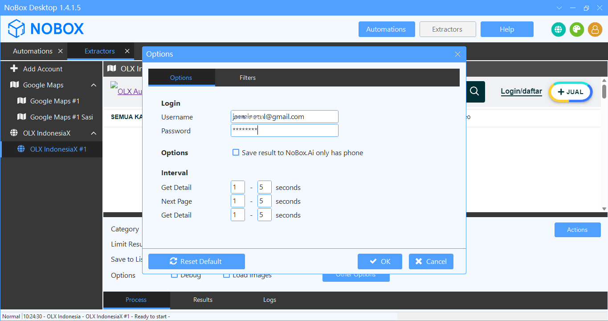

# Scrape Website OLX

OLX IndonesiaX adalah aplikasi desktop dengan dukungan browser chrome yang memungkinkan data prospek bisnis (calon pelanggan Anda) dari satu situs jaringan dengan kecepatan dan kualitas hasil yang terbaik dari berbagai negara. Software ini mengekstrak berbagai data yang tersedia dari OLX termasuk link, nama usaha, alamat, nomor telepon, website, rating, total views, jam buka, link gambar, latitude, longitude, plus code, dan bidang usaha. Data otomatis disimpan di NoBox.Ai. Anda juga dapat mengekspor data dalam format file Excel (.xlsx, .csv) dan JSON (.json).

<iframe width="742" height="418" src="https://www.youtube.com/embed/5wFLy1SciEA/" title="01. Instalasi NoBox Desktop" frameborder="0" allow="accelerometer; autoplay; clipboard-write; encrypted-media; gyroscope; picture-in-picture; web-share" referrerpolicy="strict-origin-when-cross-origin" allowfullscreen></iframe>

## **Tambah Akun**

Pastikan sudah berlangganan OLX Extractor untuk negara yang ingin ditarik datanya.Untuk menambah tool baru, silahkan buka aplikasi **NoBox Desktop ➔ \[Add Account]**, maka akan muncul dialog **\[Add Account].**

<figure><figcaption></figcaption></figure>

| Isian     | Uraian                                | Contoh Data       |
| --------- | ------------------------------------- | ----------------- |
| **Isian** | **Uraian**                            | **Contoh Data**   |
| Channel   | Channel yang Anda pilih               | OLX IndonesiaX    |
| Name      | Nama Akun Anda                        | OLX IndonesiaX #1 |
| Notes     | Berikan catatan tentang akun tersebut | -                 |
| Status    | Informasi akun aktif atau tidak       | Active            |

Jika Anda sudah melengkapi isian yang ada, klik **\[OK]** untuk menyimpan akun yang baru saja Anda buat.

## **Edit dan hapus akun**

Untuk mengedit suatu akun, silahkan buka dan login website [id.nobox.ai](https://id.nobox.ai/), klik menu **\[Accounts]**. Silahkan pilih dulu akun mana yang akan Anda edit, kemudian editlah data Anda dan klik **\[Save]** untuk menyimpan perubahan tersebut.

Untuk menghapus suatu akun, silahkan pilih akun mana yang akan dihapus, kemudian klik **\[Delete]**, maka akan tampil pemberitahuan konfirmasi apakah Anda ingin menghapus salah satu akun. Jika ya, klik **\[Yes]** jika tidak maka klik **\[No]**.

## **Konfigurasi**

OLX mendukung fitur auto login. Anda dapat secara otomatis login tanpa harus mengetik password terlebih dahulu. Caranya klik **\[Other Options]**, maka akan muncul dialog **\[Option]**, masukkan username dan password akun OLX Anda.

<figure><figcaption></figcaption></figure>

Jika Anda sudah melengkapi isian yang ada, klik **\[OK]** untuk menyimpan Username dan Password autologin yang baru saja Anda buat.

## **Pengoperasian Dasar**

Setelah setting auto login Anda bisa lanjut ke pengoperasian dasar dan fungsi utama.

<figure><figcaption></figcaption></figure>

- Buka aplikasi NoBox Desktop
- Pilih lokasi yang akan diambil datanya
- Masukkan pencarian data yang ingin ditarik datanya
- Masukkan kategori dari data yang akna diambil
- Masukkan **\[Limit Result]**
- Pilih list untuk menyimpan data hasil ekstraksi pada **\[Save to List]**, atau tambahkan list baru
- Pilih **\[Options]** untuk menampilkan mode debug atau gambar dari barang.

| Isian        | Uraian                                                      | Contoh Data         |
| ------------ | ----------------------------------------------------------- | ------------------- |
| Category     | Pilih kategori barang / jasa                                | Elektronik & Gadget |
| Limit Result | Isikan jumlah data yang ingin ditarik                       | 5                   |
| Save to list | Pilih/tambah data list untuk menyimpan data hasil ekstraksi | Laptop Malang       |
| Options      | Centang jika ingin debug dan load images                    | -                   |

## **Scrape Data**

Scrape data website OLX memungkinkan Anda mengekstrak data informasi penjual atau pemasang iklan dari berbagai daftar produk dan jasa dengan cepat, mudah dan berkualitas.

<figure><figcaption></figcaption></figure>

- Setelah pengoperasian data selesai, klik **\[Start]** untuk memulai ekstraksi data
- Tunggu beberapa saat sampai ada notifikasi bahwa ekstraksi data telah selesai
- Jika jumlah data yang diambil kurang dari jumlah yang dimasukkan, maka ada beberapa data duplikat yang dikeluarkan oleh pemasang yang sama
- Data yang sudah diambil secara otomatis akan disimpan ke menu **\[Contacts]** NoBox.Ai

---

Jika ada masalah atau kesulitan terkait NoBox Desktop, silahkan hubungi kami melalui [Support Ticket](https://crm.nobox.ai/clients/tickets)

\
