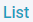
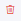

# Penawaran

Penawaran merupakan salah satu menu pada Nobox.Ai yang digunakan untuk melakukan manajemen penawaran, sehingga mempermudah anda dalam mengelola seluruh informasi dan aktivitas progress penjualan.

<iframe width="742" height="418" src="https://www.youtube.com/embed/jGn4u60uODA" title="Pengenalan Tampilan NoBox" frameborder="0" allow="accelerometer; autoplay; clipboard-write; encrypted-media; gyroscope; picture-in-picture; web-share" referrerpolicy="strict-origin-when-cross-origin" allowfullscreen></iframe>

<figure><figcaption></figcaption></figure>

Pada tampilan tersebut, terdapat beberapa bagian yang mempunyai fungsi sendiri-sendiri. Penjelasan masing-masing fungsi tersebut adalah sebagai berikut :

<table><thead><tr><th width="170.800048828125">Fitur/Tombol</th><th>Fungsi</th></tr></thead><tbody><tr><td></td><td>Digunakan untuk tambah papan.</td></tr><tr><td></td><td>Digunakan untuk tambah penawaran.</td></tr><tr><td></td><td>Digunakan untuk menampilkan pop up edit dan hapus data papan.</td></tr><tr><td></td><td>Digunakan untuk menampilkan dalam bentuk kanban.</td></tr><tr><td></td><td>Digunakan untuk menampilkan dalam bentuk list.</td></tr></tbody></table>

## **Tambah Papan**

Untuk tambah data papan, silahkan klik tombol **\[** **],** maka akan tampil dialog **\[Add Pipeline]**.

<figure><figcaption></figcaption></figure>

Lengkapi isian yang diperlukan, sebagai contoh seperti berikut :

| Isian     | Uraian          | Contoh                                                 |
| --------- | --------------- | ------------------------------------------------------ |
| Nama      | Nama papan      | Marketing                                              |
| Deskripsi | Deskripsi papan | Informasi manajemen penjualan                          |
| Stage     | Tahap manajemen | New, Qualified, Advance, Payment In Process, Won, Lost |

Jika Anda sudah melengkapi isian yang ada, klik **\[Simpan]** untuk menyimpan data papan yang baru saja Anda buat.

## **Edit Dan Hapus Data Papan**

Untuk mengedit suatu data papan, silahkan pilih terlebih dahulu data mana yang akan diedit. Klik tombol **\[****]** maka akan tampil pop up, pilih tombol **\[Edit],** lalu editlah data Anda dan klik **\[Simpan]** untuk menyimpan perubahan tersebut.

Untuk menghapus suatu data papan adalah dengan pilih data mana yang akan dihapus. Kemudian klik tombol **\[****]** maka akan tampil pop up, pilih tombol **\[Hapus]**, maka akan tampil dialog konfirmasi apakah Anda ingin menghapus data. Jika ya, klik **\[Ya]** jika tidak maka klik **\[Tidak]**.

## **Tambah Penawaran**

Untuk tambah data penawaran, silahkan klik tombol **\[** **]** maka akan tampil dialog **\[Tambah Penawaran]**.

<figure><figcaption></figcaption></figure>

Lengkapi isian yang diperlukan, sebagai contoh seperti berikut :

| Isian              | Uraian                 | Contoh                              |
| ------------------ | ---------------------- | ----------------------------------- |
| Nama Penawaran     | Nama kesepakatan       | Deal PT Puspita                     |
| Harga              | Harga kesepakatan      | Rp 10.600.000                       |
| Tugaskan Ke        | Ditugaskan kepada      | Jasmine                             |
| Tanggal Tutup      | Tanggal tutup          | 30-11-2024                          |
| Sumber             | Pencarian              | Other                               |
| Alasan gagal       | Alasan gagal penawaran | -                                   |
| Papan              | Pilihan papan          | Penawaran Bulan November 2024       |
| Tahapan            | Tahapan                | New                                 |
| Tanggal Mulai      | Tanggal mulai          | 25-11-2024                          |
| Tanggal Kadaluarsa | Tanggal kadaluarsa     | 30-11-2024                          |
| Prioritas          | Level prioritas        | Tinggi                              |
| Perusahaan         | Perusahaan kesepakatan | PT SEJAHTERA                        |
| Kontak             | List kontak terkait    | Sherin, Sasi, Afrida                |
| Produk             | List produk            | Gamis Zeyaa, Hijab Pashmina Azzalea |

Jika Anda sudah melengkapi isian yang ada, klik **\[Simpan]** untuk menyimpan data penawaran yang baru saja Anda buat.

## **Edit Dan Hapus Data Penawaran**

Untuk mengedit suatu data penawaran, silahkan pilih terlebih dahulu data mana yang akan diedit. Editlah data Anda dan klik **\[Simpan]** untuk menyimpan perubahan tersebut.

Untuk menghapus suatu data penawaran adalah dengan pilih data mana yang akan dihapus, kemudian klik **\[Hapus]**, maka akan tampil dialog konfirmasi apakah Anda ingin menghapus data. Jika ya, klik **\[Ya]** jika tidak maka klik **\[Tidak]**.

## **Komentar**

Komentar merupakan salah satu fitur Nobox.Ai yang digunakan untuk memberikan pandangan, tanggapan, atau feedback terhadap penawaran tersebut.

## **Tambah Komentar**

Untuk tambah komentar silahkan klik tombol \[] maka akan tampil dialog komentar. Isi komentar dan klik tombol **\[Send]** untuk mengirimkan komentar tersebut.

<figure><figcaption></figcaption></figure>

## **Edit dan Hapus Komentar**

Untuk mengedit suatu data komentar, silahkan pilih terlebih dahulu data mana yang akan diedit. Kemudian klik icon \[], maka akan tampil pop up Edit dan Remove. Pilih tombol \[Edit], lalu editlah data Anda dan klik \[Send] untuk menyimpan perubahan tersebut.

Untuk menghapus suatu data komentar adalah dengan pilih data mana yang akan dihapus. Kemudian klik icon \[], lalu klik \[Remove], maka akan tampil dialog konfirmasi apakah Anda ingin menghapus data. Jika ya, klik \[OK] jika tidak maka klik \[Cancel].

## **Salin Penawaran**

Salin Penawaran digunakan agar mempermudah Anda untuk salin data penawaran. Untuk salin data penawaran, silahkan klik icon \[], lalu pilih **\[Copy]**. Maka hasilnya akan ada salinan data penawaran tersebut.

<figure><figcaption></figcaption></figure>

## **Tugas**

Tugas adalah tab yang digunakan untuk manajemen tugas yang akan dikerjakan oleh penawaran tersebut.

<figure><figcaption></figcaption></figure>

## **Tambah Tugas**

Untuk tambah data Tugas, silahkan klik tombol **\[****]** maka akan tampil dialog **\[Tambah Tugas]**.

<figure><figcaption></figcaption></figure>

Lengkapi isian yang diperlukan, sebagai contoh seperti berikut :

| Isian                    | Uraian                                       | Contoh               |
| ------------------------ | -------------------------------------------- | -------------------- |
| Nama                     | Nama tugas                                   | Meeting PT Sejahtera |
| Detail/Rencana           | Rincian atau rencana tugas                   | Pembahasan proposal  |
| Langkah Berikutnya/Hasil | Langkah selanjutnya atau hasil tugas         | Diskusi harga        |
| Lampiran                 | Lampiran tugas                               | -                    |
| Pemilik                  | Pemilik tugas                                | Jasmine              |
| List                     | List tugas                                   | Baru                 |
| Kategori                 | Kategori tugas                               | Marketing            |
| Prioritas                | Level prioritas                              | Tinggi               |
| Tag                      | Tag tugas                                    | Meeting              |
| Tanggal Mulai            | Awal Batas waktu                             | 29-11-2024           |
| Tanggal Selesai          | Akhir batas waktu                            | 30-11-2024           |
| kontak                   | Kontak yang mengerjakan tugas tersebut       | Sherin               |
| Perusahaan               | Perusahaan yang mengerjakan tugas tersebut   | PT SEJAHTERA         |
| Transaksi                | Penawaran yang terkait dengan tugas tersebut | Deal PT Puspita      |

Jika Anda sudah melengkapi isian yang ada, klik **\[Simpan]** untuk menyimpan data tugas yang baru saja Anda buat.

## **Edit Dan Hapus Data Tugas**

Untuk mengedit suatu data tugas, silahkan pilih terlebih dahulu data mana yang akan diedit. Editlah data Anda dan klik **\[Simpan]** untuk menyimpan perubahan tersebut.

Untuk menghapus suatu data tugas adalah dengan pilih data mana yang akan dihapus, kemudian klik **\[Hapus]**, maka akan tampil dialog konfirmasi apakah Anda ingin menghapus data. Jika ya, klik **\[Ya]** jika tidak maka klik **\[Tidak]**.

**Transaksi**

Transaksi merupakan salah satu fitur Nobox.Ai yang digunakan untuk mencatat transaksi terkait pembayaran dengan penawaran tersebut.

<figure><figcaption></figcaption></figure>

## **Tambah Transaksi**

Untuk menambahkan data transaksi, silahkan klik **\[Tambah Transaksi]** maka akan tampil dialog **\[Tambah Transaksi]**.

<figure><figcaption></figcaption></figure>

Lengkapi isian yang diperlukan, sebagai contoh seperti berikut :

| Isian      | Uraian                             | Contoh                |
| ---------- | ---------------------------------- | --------------------- |
| Catatan    | Catatan transaksi                  | Penawaran Gamis Zeyaa |
| Tanggal    | Pilih tanggal transaksi            | 30-11-2024            |
| Dari       | Pilih kontak terkait transaksi     | Sasi                  |
| Cara Bayar | Metode Pembayaran                  | Transfer              |
| Deskripsi  | Deskripsi transaksi                | Bayar Cicil           |
| Mata Uang  | Pilih mata uang dan isi nominalnya | Rp 5.000.000          |
| Lampiran   | Lampiran transaksi                 | -                     |

Jika Anda sudah melengkapi isian yang ada, klik **\[Simpan]** untuk menyimpan data transaksi yang baru saja Anda buat.

## **Edit Dan Hapus Data Transaksi**

Untuk mengedit suatu data transaksi, silahkan pilih terlebih dahulu data mana yang akan diedit. Editlah data Anda dan klik **\[Simpan]** untuk menyimpan perubahan tersebut.

Untuk menghapus suatu data transaksi adalah dengan pilih data mana yang akan dihapus, kemudian klik **\[Hapus]**, maka akan tampil dialog konfirmasi apakah Anda ingin menghapus salah satu data. Jika ya, klik **\[Ya]** jika tidak maka klik **\[Tidak]**.

## **Pengeluaran**

Pengeluaran merupakan salah satu fitur Nobox.Ai yang digunakan untuk mencatat pengeluaran atau biaya yang mencakup berbagai hal, seperti biaya pengiriman, biaya pemasaran, dsb.

<figure><figcaption></figcaption></figure>

## **Tambah Pengeluaran**

Untuk menambahkan data pengeluaran, silahkan klik **\[Tambah Pengeluaran]** maka akan tampil dialog **\[Tambah Pengeluaran]**.

<figure><figcaption></figcaption></figure>

Lengkapi isian yang diperlukan, sebagai contoh seperti berikut :

<table><thead><tr><th width="217.4000244140625">Isian</th><th width="230.5999755859375">Uraian</th><th>Contoh</th></tr></thead><tbody><tr><td>Tanggal Pengeluaran</td><td>Pilih tanggal pengeluaran dan jamnya</td><td>30-11-2024, 13:36</td></tr><tr><td>Jumlah Pengeluaran</td><td>Pilih mata uang dan nominalnya</td><td>Rp 200.000</td></tr><tr><td>Kontak</td><td>Kontak terkait pengeluaran tersebut</td><td>Sasi</td></tr><tr><td>Perusahaan</td><td>Perusahaan terkait pengeluaran tersebut</td><td>PT Puspita</td></tr><tr><td>Penawaran</td><td>Penawaran terkait (otomatis terisi)</td><td>Deal PT Puspita</td></tr><tr><td>Kategori</td><td>Pilih kategori</td><td>Biaya Pengiriman</td></tr><tr><td>Deskripsi</td><td>Deskripsi pengeluaran</td><td>Tambahan biaya pengiriman</td></tr><tr><td>Unggah</td><td>Lampiran pengeluaran</td><td>-</td></tr></tbody></table>

Jika Anda sudah melengkapi isian yang ada, klik **\[Simpan]** untuk menyimpan data pengeluaran yang baru saja Anda buat.

## **Edit Dan Hapus Data Pengeluaran**

Untuk mengedit suatu data pengeluaran, silahkan pilih terlebih dahulu data mana yang akan diedit. Editlah data Anda dan klik **\[Simpan]** untuk menyimpan perubahan tersebut.

Untuk menghapus suatu data pengeluaran adalah dengan pilih data mana yang akan dihapus, kemudian klik **\[Hapus]**, maka akan tampil dialog konfirmasi apakah Anda ingin menghapus salah satu data. Jika ya, klik **\[Ya]** jika tidak maka klik **\[Tidak]**.

## **Catatan**

Catatan adalah tab yang digunakan untuk mencatat dan menyimpan informasi penting terkait dengan penawaran tersebut.

<figure><figcaption></figcaption></figure>

## **Tambah Catatan**

Untuk membuat data catatan, Anda dapat mengetikkan langsung di bagian . Jika Anda sudah mengisi catatan, silahkan klik tombol  untuk menyimpan catatan.

## **Edit dan Hapus Data Catatan**

Fitur ini hanya bisa digunakan oleh NoBox Supervisor, agen hanya bisa menambahkan catatan tetapi tidak bisa mengedit atau menghapus data catatan.

Untuk mengedit suatu data catatan, silahkan klik icon **\[**  **]** di bagian samping catatan yang ingin Anda edit. Editlah data tersebut dan klik tombol kirim atau tekan enter pada keyboard Anda untuk menyimpan perubahan tersebut.

Untuk menghapus data catatan, silahkan klik icon \[] di bagian samping catatan yang ingin dihapus. Maka akan muncul dialog konfirmasi apakah Anda ingin menghapus catatan tersebut. Jika ya, klik **\[Ya]** jika tidak maka klik **\[Tidak]**.

## **Log**

Log adalah salah satu fitur Nobox.Ai untuk memberikan informasi aktivitas terkait dengan penawaran tersebut.

<figure><figcaption></figcaption></figure>

***

Jika ada masalah atau kesulitan terkait Nobox.Ai, silahkan hubungi kami melalui [Support Ticket](https://crm.nobox.ai/clients/tickets)
