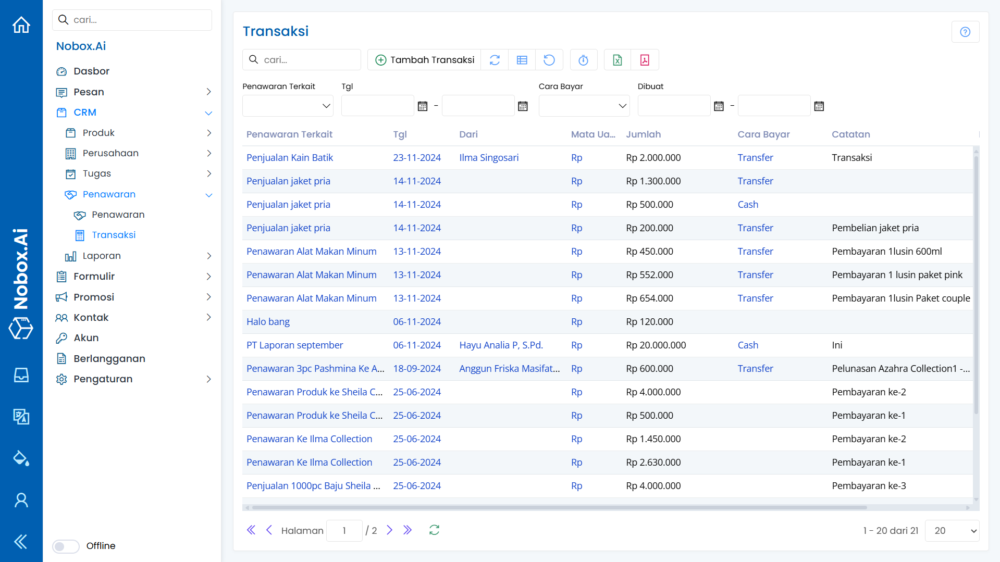

# Transaksi

Transaksi merupakan salah satu menu Nobox.Ai yang digunakan untuk mencatat transaksi terkait pembayaran dengan penawaran.

<iframe width="742" height="418" src="https://www.youtube.com/embed/X1w93uAPn-8" title="Pengenalan Tampilan NoBox" frameborder="0" allow="accelerometer; autoplay; clipboard-write; encrypted-media; gyroscope; picture-in-picture; web-share" referrerpolicy="strict-origin-when-cross-origin" allowfullscreen></iframe>

<figure><figcaption></figcaption></figure>

## **Tambah Transaksi**

Untuk menambahkan data transaksi, silahkan klik **\[Tambah Transaksi]** maka akan tampil dialog **\[Tambah Transaksi]**.

<figure><figcaption></figcaption></figure>

Lengkapi isian yang diperluakan, sebagai contoh seperti berikut :

| Isian             | Uraian                             | Contoh                        |
| ----------------- | ---------------------------------- | ----------------------------- |
| 
Papan 
  | Pilih papan                        | Penawaran Bulan November 2024 |
| Penawaran Terkait | Pilih data penawaran               | PT Bimantara                  |
| Catatan           | Catatan transaksi                  | Uang muka                     |
| Tgl               | Pilih tanggal transaksi            | 28-17-2024                    |
| Dari              | Pilih kontak terkait transaksi     | Sheila Syandana               |
| Cara Bayar        | Metode Pembayaran                  | Cash                          |
| Deskripsi         | Deskripsi transaksi                | Uang muka                     |
| Mata Uang         | Pilih mata uang dan isi nominalnya | Rp 500.000                    |
| Lampiran          | Lampiran transaksi                 | -                             |

Jika Anda sudah melengkapi isian yang ada, klik **\[Simpan]** untuk menyimpan data transaksi yang baru saja Anda buat.

## **Edit Dan Hapus Data Transaksi**

Untuk mengedit suatu data transaksi, silahkan pilih terlebih dahulu data mana yang akan diedit. Editlah data Anda dan klik **\[Simpan]** untuk menyimpan perubahan tersebut. Untuk menghapus suatu data transaksi adalah dengan pilih data mana yang akan dihapus, kemudian klik **\[Hapus]**, maka akan tampil dialog konfirmasi apakah Anda ingin menghapus salah satu data. Jika ya, klik **\[Ya]** jika tidak maka klik **\[Tidak]**.

***

Jika ada masalah atau kesulitan terkait Nobox.Ai, silahkan hubungi kami melalui [Support Ticket](https://crm.nobox.ai/clients/tickets)
