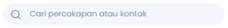
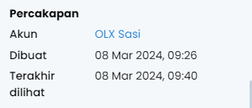
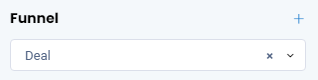

# Kotak Masuk

Kotak Masuk adalah salah satu menu NoBox.Ai yang digunakan untuk melayani semua pesan yang masuk dari beberapa channel seperti WhatsApp, Telegram, Shopee dll.

<iframe width="742" height="418" src="https://www.youtube.com/embed/CeNBiHeQ1aU" title="Pengenalan Tampilan NoBox" frameborder="0" allow="accelerometer; autoplay; clipboard-write; encrypted-media; gyroscope; picture-in-picture; web-share" referrerpolicy="strict-origin-when-cross-origin" allowfullscreen></iframe>

<figure><figcaption></figcaption></figure>

<table><thead><tr><th width="134.5999755859375">Fitur/Tombol</th><th>Fungsi</th></tr></thead><tbody><tr><td>Semua</td><td>Semua percakapan yang masuk.</td></tr><tr><td>Baru</td><td>Semua percakapan yang belum ditugaskan ke agen.</td></tr><tr><td>Proses</td><td>Berisi percakapan yang telah ditugaskan kepada agen.</td></tr><tr><td>Selesai</td><td>Berisi percakapan yang telah selesai/dijawab dengan sempurna dan agen ingin menutup percakapan.</td></tr></tbody></table>

- Arsip Percakapan adalah fitur untuk menyimpan atau menyortir pesan-pesan yang mungkin tidak lagi relevan atau perlu ditanggapi. Dengan mengarsipkan, pengguna dapat membersihkan daftar percakapan utama mereka tanpa menghapus pesan-pesan tersebut secara permanen. Silahkan klik ikon **\[****]** untuk menampilkan percakapan yang diarsipkan.
- Anda dapat filter percakapan sesuai dengan Status, Kanal, Akun, Kontak, dsb. Untuk filter percakapan silahkan klik ikon **\[****]** maka akan tampil filter percakapan. Filter data yang diinginkan klik tombol **\[Tampilkan]** maka percakapan akan tampil sesuai dengan filter. Klik **\[Reset]** untuk menghapus filter percakapan.

- Fitur Buat Percakapan memungkinkan pengguna untuk memulai percakapan baru dengan kontak yang sudah ada dalam daftar mereka. Ini bisa sangat berguna untuk inisiasi obrolan dengan seseorang tanpa harus mencari nama kontak atau grup secara manual. Silahkan klik ikon **\[****]** untuk membuat percakapan baru.
- Fitur Pencarian digunakan untuk melakukan mencari percakapan atau kontak yang sesuai dengan kata kunci yang diketik.

## **Pembagian Pesan Masuk ke Agen**

Pada halaman Kotak Masuk, supervisor dapat mengalokasikan pelanggan kepada agen yang tersedia. Untuk tambah agen silahkan klik tombol **\[+ Agen]** maka akan tampil agen-agen yang tersedia klik nama agen untuk pilih agen tersebut.

<figure><figcaption></figcaption></figure>

Sistem juga bisa secara otomatis mendistribusikan pelanggan kepada agen yang sedang online.

<figure><figcaption></figcaption></figure>

## **Cara Mengaktifkan Selesai Otomatis atau Arsip Otomatis**

Untuk mengaktifkan fitur Selesai Otomatis dan Arsip Otomatis, dapat Anda lakukan dengan cara berikut :

1\. Buka modul **\[Pengaturan] ➔** klik menu **\[Profil Usaha]**.

2\. Aktifkan pada kategori Selesai Otomatis atau Arsip Otomatis.

3\. Isi setiap berapa jam akan otomatis menutup percakapan atau arsip percakapan.

<figure><figcaption></figcaption></figure>

## **Selesai Otomatis**

Pada halaman Kotak Masuk, terdapat fitur selesai otomatis yang digunakan untuk pengaturan aktif atau tidaknya menandai selesai pada percakapan secara otomatis. Fitur ini berlaku untuk chat yang statusnya Proses.

<figure><figcaption></figcaption></figure>

Jika Anda ingin menandai selesai secara langsung tanpa menunggu dari Selesai Otomatis Anda dapat klik ikon **\[****]** maka akan tampil pop up pilih **\[Tandai Selesai]**.

## Arsip Otomatis

Pada halaman Kotak Masuk, terdapat fitur arsip otomatis yang digunakan untuk pengaturan aktif atau tidaknya mengarsipkan pada percakapan secara otomatis. Fitur ini berlaku untuk chat yang statusnya Selesai.

<figure><figcaption></figcaption></figure>

Jika Anda ingin mengarsipkan secara langsung tanpa menunggu dari arsip otomatis Anda dapat klik ikon **\[****]** maka secara langsung percakapan akan terarsipkan.

## **Pin Percakapan**

Pada halaman Kotak Masuk, terdapat fitur pin percakapan yang digunakan untuk menyematkan pesan penting. Jika Anda ingin pin percakapan Anda dapat klik ikon **\[****]** maka akan tampil pop up pilih **\[Pin]**.

<figure><figcaption></figcaption></figure>

## **Unpin Percakapan**

Anda juga dapat menghapus pin percakapan dengan cara pilih salah satu percakapan yang sudah terpin, kemudian klik ikon \[] maka akan tampil pop up pilih **\[Unpin]**.

<figure><figcaption></figcaption></figure>

## **Informasi Percakapan**

Pada halaman Kotak Masuk terdapat informasi chat, silahkan klik tombol **\[****]** maka informasi percakapan akan tampil.&#x20;

<figure><figcaption></figcaption></figure>

Terdapat beberapa bagian yang mempunyai fungsi masing-masing. Penjelasan dari fungsi tersebut adalah sebagai berikut :

- Informasi (nama, foto profile dan nomer telp).
- Riwayat Percakapan adalah fitur yang digunakan untuk menampilkan riwayat percakapan yang telah selesai.

- Terdapat informasi nama dan alamat kontak, untuk edit data kontak silahkan klik ikon **\[****]** maka akan diarahkan ke edit kontak.

- Terdapat informasi percakapan dari akun yang menangani, tanggal buat percakapan dan tanggal terakhir kirim pesan.

- Notes adalah catatan terkait dengan percakapan yang dipilih, untuk catatan bisa ditambah, edit dan di hapus. Jadi agen yang lain dapat menambahkan catatan.

- Tags adalah salah satu fitur yang digunakan untuk mengelompokkan data percakapan Anda dan bisa menambahkan lebih dari satu tag di dalam suatu chat.

- Promosi adalah salah satu fitur yang digunakan untuk informasi promosi yang terhubung dengan percakapan tersebut.

- Funnel salah satu fitur yang digunakan untuk mengkategorikan tahapan proses pemasaran dan support, atau juga bisa Anda buat funnel baru.

- Deal adalah salah satu fitur yang digunakan untuk menghubungkan deal dengan percakapan tersebut.

- Agen adalah salah satu fitur yang digunakan untuk informasi agen siapa saja yang menangani percakapan tersebut.

## **Cara Balas Pesan**&#x20;

Anda dapat membalas pesan masuk secara langsung dengan NoBox untuk membalas pesan yang masuk. Buka salah satu percakapan, kemudian balas sesuai dengan apa yang ditanyakan.

<figure><figcaption></figcaption></figure>

Informasi pesan terkirim atau tidak dapat dilihat dari tanda pesan. Jika pesan bertanda **\[****]** pesan sudah terkirim, jika pesan bertanda **\[****]** pesan belum terkirim.

## **Hapus Pesan**

Pada halaman Kotak Masuk, terdapat fitur hapus pesan yang digunakan untuk menghilangkan pesan dari percakapan, fitur ini hanya untuk hapus pesan di NoBox saja. Untuk menghapus pesan, silahkan pilih satu pesan yang akan dihapus, kemudian klik **\[Hapus]** maka akan muncul konfirmasi apakah Anda ingin menghapus pesan tersebut. Jika ya klik **\[Ya]** jika tidak klik **\[Tidak]**.&#x20;

<figure><figcaption></figcaption></figure>

## **Kirim File**

Pada halaman Kotak Masuk, terdapat fitur untuk mengirim file dari file berupa gambar, photo, voice note, pdf, excel dll. Untuk kirim file, silahkan klik ikon **\[****]** pilih yang akan file yang akan dikirim **\[****]**. Maka akan tampil dialog **\[Pilih File]** upload file dan kirim.

<figure><figcaption></figcaption></figure>

## **Balasan Cepat**

Salah satu menu pada NoBox yang digunakan untuk template pesan agar dapat membalas pesan lebih cepat berupa pesan text atau media seperti gambar, GIF dan Video. Untuk mengirimkan balasan cepat, Anda perlu mengikuti langkah-langkah berikut :

1\. Pada inputan pesan, tekan **"/"** .

2\. Kemudian, muncul list untuk memilih quick reply yang tersedia. Pilih salah satu balasan cepat.

3\. Maka, balasan cepat akan otomatis tertulis di kolom pesan, lalu Anda dapat tekan tombol \[] untuk mengirimkan pesan tersebut.

<figure><figcaption></figcaption></figure>

---

Jika ada masalah atau kesulitan terkait NoBox, silahkan hubungi kami melalui [Support Ticket](https://crm.nobox.ai/clients/tickets)
