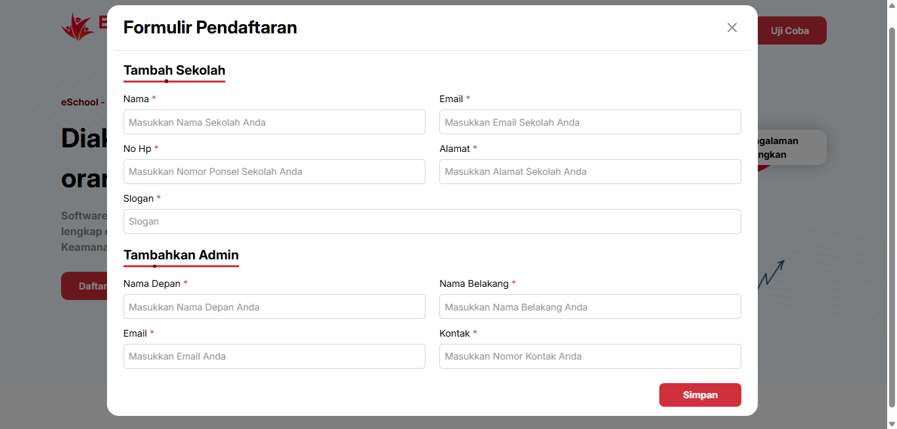

# Pendaftaran eSchool

## Cara Mendaftar dan Berlangganan eSchool

Aplikasi eSchool hanya dapat digunakan oleh sekolah yang telah berlangganan resmi melalui tim eSchool. Proses pendaftaran akun dilakukan oleh tim admin eSchool, bukan oleh sekolah atau pengguna secara langsung.

### Langkah-langkah Pendaftaran:

1. Sekolah melakukan pendaftaran di halaman website eSchool Siakad dengan klik tombol "Daftarkan Sekolah Anda".

   <figure>
     
     <figcaption><em>Tampilan Halaman Awal – Klik tombol 'Daftarkan Sekolah Anda'</em></figcaption>
   </figure>

2. Isi formulir pendaftaran sekolah dan admin yang muncul setelah tombol ditekan.

   <figure>
     
     <figcaption><em>Isi data sekolah dan admin utama dengan lengkap dan benar</em></figcaption>
   </figure>

belum sesuai
3. Setelah aktivasi, admin eSchool akan:
   - Membuat akun admin sekolah (untuk kepala sekolah/operator).
   - Menyediakan akses login awal.
4. Admin sekolah kemudian dapat membuat dan mengelola akun pengguna lain seperti:
   - Guru
   - Siswa
   - Orang tua/wali murid
5. Akun pengguna akan dikirimkan via email atau media komunikasi resmi dari pihak sekolah.

---

## Penting

- Pendaftaran tidak dapat dilakukan secara mandiri oleh individu (guru/siswa/orang tua).
- Seluruh proses dimulai dari permintaan resmi sekolah ke pihak eSchool.
- Jika Anda adalah individu yang ingin menggunakan eSchool, silakan arahkan pihak sekolah Anda untuk menghubungi kami.

---

## Hubungi Kami

Untuk mengajukan langganan atau mengetahui lebih lanjut:

- 🌐 Website: [eschool.ac.id](https://eschool.ac.id)
- 📬 Kontak: [eschool.ac.id/kontak](https://eschool.ac.id/kontak)