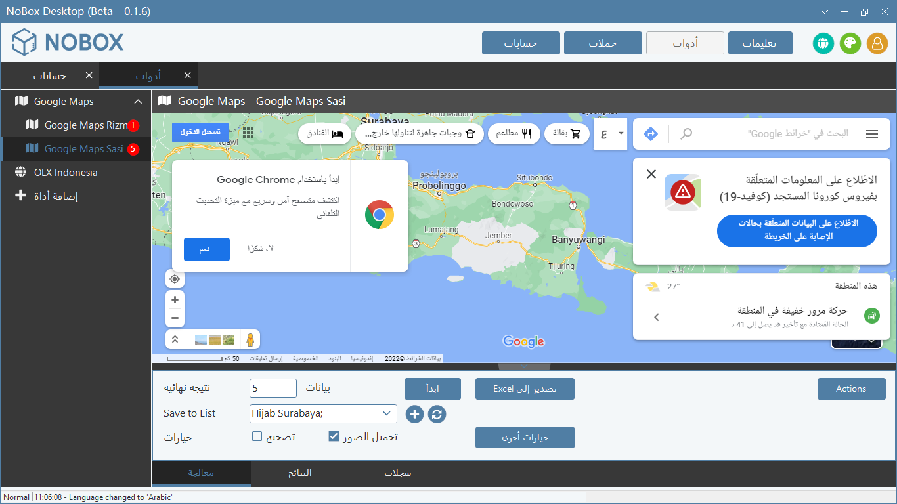
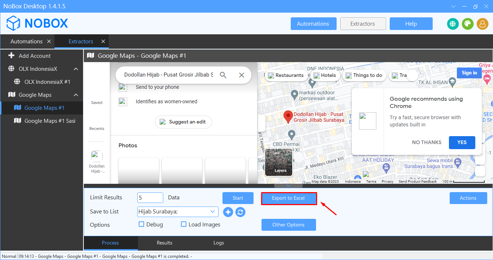

# Google Maps Extractor

Untuk mendukung semua kelebihannya, Google Maps Extractor menawarkan sejumlah fitur menarik yang dapat Anda manfaatkan. Diantara sekian banyaknya pilihan fitur yang ada, Anda bisa memanfaatkan beberapa fitur pilihan di bawah ini :

<iframe width="742" height="418" src="https://www.youtube.com/embed/i2JsGX__WRg/" title="01. Instalasi NoBox Desktop" frameborder="0" allow="accelerometer; autoplay; clipboard-write; encrypted-media; gyroscope; picture-in-picture; web-share" referrerpolicy="strict-origin-when-cross-origin" allowfullscreen></iframe>

## **Set Karakter Unicode**

NoBox dapat menyimpan hasil pencarian yang diambil dalam format unicode seperti Arabic, Chinesse, Japan, dl&#x6C;**.**\

<figure><figcaption></figcaption></figure>

- Ubah setting bahasa terlebih dahulu.
- Lakukan ekstraksi data.&#x20;
- Jika sudah selesai nantinya data hasil ekstraksi akan tersimpan sesuai bahasa yang dipilih.

## **Interval Get List**

Fitur untuk mengatur waktu cepat lambatnya antara permintaan satu dengan berikutnya, agar mensimulasikan seperti manusia nyata yang menjalankan browser.

<figure><figcaption></figcaption></figure>

## **Page Process**

Halaman yang berfungsi untuk setting ketentuan data yang akan diambil.

<figure><figcaption></figcaption></figure>

<table><thead><tr><th width="174.60003662109375">Fitur</th><th>Uraian</th></tr></thead><tbody><tr><td>Limit Result</td><td>Penambahan data sesuai dengan kebutuhan berapa jumlah data yang di inginkan.</td></tr><tr><td>Save To List</td><td>Simpan dan tambah nama file, jadi ketika ingin menambah data list bisa menggunakan fitur ini, caranya tinggal menekan tombol <strong>[+]</strong> lalu beri nama list sesuai yang di inginkan setelah itu tekan <strong>[OK]</strong></td></tr><tr><td>Option Debug </td><td>Munculkan logs aktivitas dengan sangat detail</td></tr><tr><td>Option Load Images</td><td>Menampilkan gambar pada data</td></tr><tr><td>Other Option</td><td>Pengaturan Interval untuk pemilihan lokasi negara, dan di bagian bawah terdapat pengaturan Interval untuk pengambilan data. </td></tr></tbody></table>

## **Page Result**

Result adalah halaman yang menampilkan hasil dari data yang diambil.

<figure><figcaption></figcaption></figure>

## **Page Logs**

Logs adalah halaman untuk melihat semua aktivitas sistem yang sedang berlangsung.

<figure><figcaption></figcaption></figure>

## **Multi Tab**

Digunakan untuk menjalankan proses pencarian dengan berbagai kata kunci secara bersamaan.

<figure><figcaption></figcaption></figure>

- Lakukan ekstrasi data pada 2 akun extractor, tambahkan dengan **"Add Account"**
- Extractor yang pertama, misalnya lakukan pencarian bebas, dan dengan jumlah data sebanyak 5, dan tambahkan list yang baru.

## **Website NoBox.Ai**

Untuk urusan data yang sudah diekstraksi akan langsung tersimpan pada website NoBox.Ai, sehingga Anda dapat mengakses dan memantau hasilnya dengan browser dan perangkat apa saja.

<figure><figcaption></figcaption></figure>

- Masuk ke bagian **\[Contacts]** dan pilih menu **\[Contacts]**
- Pilih filter **\[Source -> Google Maps]**
- Aktifkan fitur **\[Auto Refresh]**, untuk memantau data apa saja yang berhasil diproses

## **Export Data**

NoBox menyediakan opsi untuk menyimpan data yang diekstraksi dalam format Excel (.xlsx, .csv), dan file format JSON (.json).

<figure><figcaption></figcaption></figure>

- Klik **\[Export to Excel]** dibagian page **\[Process]**&#x20;
- Untuk melihat data apa saja yang baru saja diambil, bisa juga dilihat dari page **\[Results]** lalu klik button **\[Action]** untuk export dalam format excel, csv, dan JSON

## **Penanganan Komputer Mati Saat Ekstrak Data**

NoBox menyediakan fitur jika komputer/software mati secara tidak terduga saat proses ekstraksi data.&#x20;

<figure><figcaption></figcaption></figure>

- Buka kembali aplikasi NoBox dan masuk ke menu **\[Extractor -> Google Maps]**. Akan ada pemberitahuan bahwa proses sebelumnya masih belum selesai.
- Klik **\[OK]** untuk melanjutkan proses pencarian data
- Klik **\[Cancel]** untuk membatalkan pencarian

---

Jika ada masalah atau kesulitan terkait NoBox Desktop, silahkan hubungi kami melalui [Support Ticket](https://crm.nobox.ai/clients/tickets)
