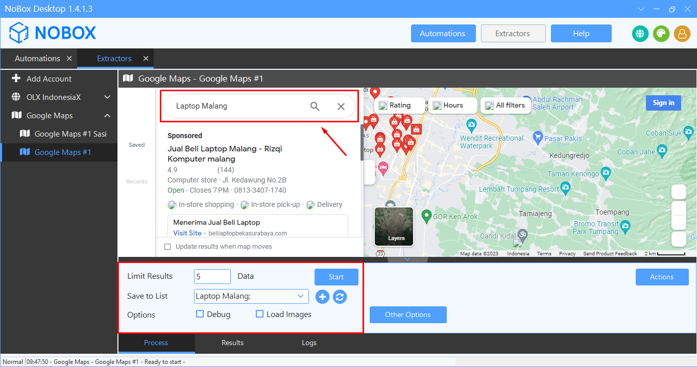

# Scrape Google Maps

Google Maps Extractor bisa mengekstrak data prospek bisnis (calon pelanggan Anda) dari Google Maps dengan kecepatan dan kualitas hasil yang terbaik. Software ini mengekstrak berbagai data yang tersedia dari Google Maps termasuk link, nama usaha, alamat, nomor telepon, website, rating, total views, jam buka, link gambar, latitude, longitude, plus code, dan bidang usaha. Data otomatis disimpan di NoBox.Ai. Anda dapat mengekspor data dalam format file Excel (.xlsx, .csv) dan JSON (.json).

## **Tambah Akun**

Untuk menambah Extractor baru, silahkan buka aplikasi **NoBox Desktop ➔ \[Add Account]**, maka akan muncul dialog **\[Add Account]**.

<figure><figcaption></figcaption></figure>

| Isian   | Uraian                                 | Contoh Data    |
| ------- | -------------------------------------- | -------------- |
| Channel | Channel yang Anda pilih                | Google Maps    |
| Name    | Nama Akun Anda                         | Google Maps #1 |
| Notes   | Berikan catatan tentang akun tersebut  | -              |
| Status  | Informasi akun aktif atau tidak        | Active         |

Jika Anda sudah melengkapi isian yang ada, klik **\[OK]** untuk menyimpan akun yang baru saja Anda buat.

## **Pengoperasian Dasar**

Sebelum ke tahap scrape data, Anda harus paham mengenai pengoperasian dasar aplikasi dan fungsi fitur Google Maps Extractor seperti berikut :

<figure><figcaption></figcaption></figure>

* Buka aplikasi NoBox Desktop
* Masukkan pencarian data yang akan diambil pada kolom **\[Search Google Maps]**
* Isi bagian page **\[Process]**
* Masukkan **\[Limit Result]** untuk menentukan berapa jumlah data yang akan diambil
* Pilih list untuk menyimpan data hasil ekstraksi pada **\[Save to List]** atau tambahkan list baru
* Pilih **\[Options]** untuk  menampilkan mode debug atau gambar dari barang.&#x20;

| Isian        | Uraian                                                      | Contoh Data   |
| ------------ | ----------------------------------------------------------- | ------------- |
| Limit Result | Isikan jumlah data yang ingin ditarik                       | 5             |
| Save to list | Pilih/tambah data list untuk menyimpan data hasil ekstraksi | Laptop Malang |
| Options      | Centang jika ingin debug dan load images                    | -             |

## **Scrape Data**

Scrape data Google Maps memungkinkan Anda mengekstrak data informasi penjual atau pemasang iklan dari berbagai daftar produk dan jasa dengan cepat, mudah dan berkualitas.

<figure><figcaption></figcaption></figure>

* Setelah pengoperasian data selesai, klik **\[Start]** untuk memulai ekstraksi data
* Tunggu beberapa saat sampai ada notifikasi bahwa ekstraksi data telah selesai
* Jika jumlah data yang diambil kurang dari jumlah yang dimasukkan, maka ada beberapa data duplikat yang dikeluarkan oleh pemasang yang sama
* Data yang sudah diambil secara otomatis akan disimpan ke menu Contacts NoBox.Ai

## **Filter Google Maps**

Dalam fitur Google Maps terdapat beberapa macam filter, diantaranya :

## **Filter By Category**

Anda dapat memfilter data yang akan kita ambil berdasarkan kategorinya, caranya adalah sebagai berikut :

* Buka channel google maps dan pilih kategori yang akan dicari.

<figure><figcaption></figcaption></figure>

* Masukkan **\[Limit Result]** untuk menentukan berapa jumlah data yang akan diambil.
* Pilih list untuk menyimpan data hasil ekstraksi pada **\[Save to List]** atau tambahkan list baru.
* Pilih **\[Options]** untuk menampilkan mode debug atau gambar dari barang.
* Setelah pengoperasian data selesai, klik **\[Start]** untuk memulai ekstraksi data.

## **Filter By Open Hours**

Anda dapat memfilter data yang akan kita ambil berdasarkan jam buka tempat tersebut, caranya adalah sebagai berikut :

* Buka channel google maps, masukkan pencarian data yang akan diambil pada kolom **\[Search Google Maps]** dan pilih jam buka yang akan dicari.

<figure><figcaption></figcaption></figure>

* Masukkan **\[Limit Result]** untuk menentukan berapa jumlah data yang akan diambil.
* Pilih list untuk menyimpan data hasil ekstraksi pada **\[Save to List]** atau tambahkan list baru.
* Pilih **\[Options]** untuk menampilkan mode debug atau gambar dari barang.
* Setelah pengoperasian data selesai, klik **\[Start]** untuk memulai ekstraksi data.

## **Filter By Rating**

Anda dapat memfilter data yang akan kita ambil berdasarkan penilaian tempat tersebut, caranya adalah sebagai berikut :

* Buka channel google maps, masukkan pencarian data yang akan diambil pada kolom **\[Search Google Maps]** dan pilih penilaian yang akan dicari

<figure><figcaption></figcaption></figure>

* Masukkan **\[Limit Result]** untuk menentukan berapa jumlah data yang akan diambil.
* Pilih list untuk menyimpan data hasil ekstraksi pada **\[Save to List]** atau tambahkan list baru.
* Pilih **\[Options]** untuk menampilkan mode debug atau gambar dari barang.
* Setelah pengoperasian data selesai, klik **\[Start]** untuk memulai ekstraksi data.

## **Filter By Multiple**

Anda dapat memfilter data yang akan kita ambil berdasarkan beberapa filter, caranya adalah sebagai berikut :

* Buka channel google maps, masukkan pencarian data yang akan diambil pada kolom **\[Search Google Maps]** dan pilih beberapa filter yang akan dicari. Misalnya jam buka dan penilaian tempat tersebut.

<figure><figcaption></figcaption></figure>

* Masukkan **\[Limit Result]** untuk menentukan berapa jumlah data yang akan diambil.
* Pilih list untuk menyimpan data hasil ekstraksi pada **\[Save to List]** atau tambahkan list baru.
* Pilih **\[Options]** untuk menampilkan mode debug atau gambar dari barang.
* Setelah pengoperasian data selesai, klik **\[Start]** untuk memulai ekstraksi data.

## **Edit dan Hapus akun**

Untuk mengedit suatu akun, silahkan buka dan login website [id.nobox.ai](https://id.nobox.ai/),  klik menu **\[Accounts]**. Silahkan pilih dulu akun mana yang akan Anda edit, kemudian editlah data Anda dan klik **\[Save]** untuk menyimpan perubahan tersebut.

Untuk menghapus suatu akun, silahkan pilih akun mana yang akan dihapus, kemudian klik **\[Delete]**, maka akan tampil pemberitahuan konfirmasi apakah Anda ingin menghapus salah satu akun. Jika ya, klik **\[Yes]** jika tidak maka klik **\[No]**

***

Jika ada masalah atau kesulitan terkait NoBox Desktop, silahkan hubungi kami melalui [Support Ticket](https://crm.mynobox.com/clients/tickets)
