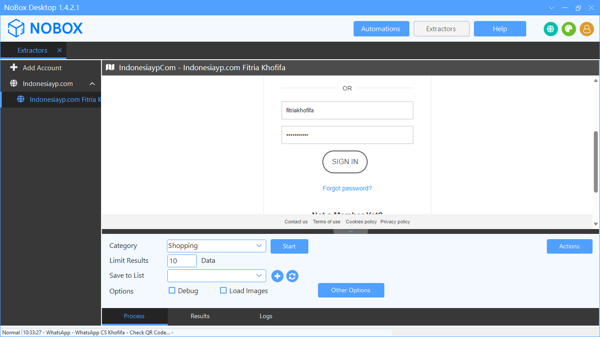
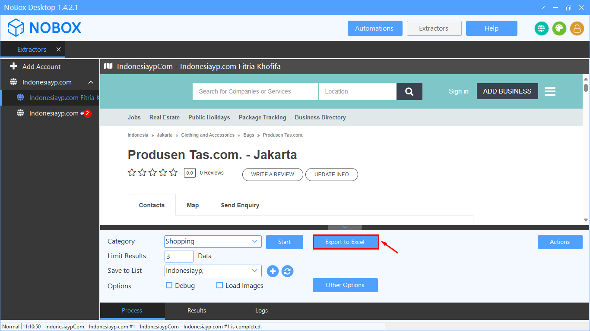
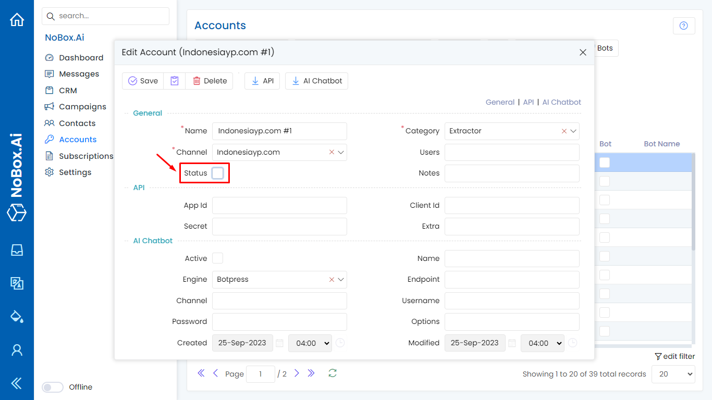

# Indonesiayp.com Extractor

Indonesiayp.com Extractor merupakan fitur yang digunakan untuk mengekstrak data prospek bisnis dari Indonesiayp.com dengan kecepatan dan kualitas hasil yang terbaik.

<iframe width="742" height="418" src="https://www.youtube.com/embed/h5lGGJP_V8M/" title="01. Instalasi NoBox Desktop" frameborder="0" allow="accelerometer; autoplay; clipboard-write; encrypted-media; gyroscope; picture-in-picture; web-share" referrerpolicy="strict-origin-when-cross-origin" allowfullscreen></iframe>

## **Tambah Akun**

Untuk menambah Extractor baru, silahkan buka aplikasi **NoBox Desktop ➔ \[Extractor] ➔ \[Add Account]**, maka akan muncul dialog **\[Add Account]**.

<figure><figcaption></figcaption></figure>

| Isian   | Uraian                                | Contoh                         |
| ------- | ------------------------------------- | ------------------------------ |
| Channel | Channel yang Anda pilih               | Indonesiayp.com                |
| Name    | Nama Akun Anda                        | Indonesiayp.com Fitria Khofifa |
| Notes   | Berikan catatan tentang akun tersebut | -                              |
| Status  | Informasi akun aktif atau tidak       | Active                         |

Jika Anda sudah melengkapi isian yang ada, klik **\[OK]** untuk menyimpan akun yang baru saja Anda buat.

## **Konfigurasi**

Setelah menambah akun baru, Anda hanya perlu membuka akun Indonesiayp yang sudah Anda buat melalui PC/laptop.&#x20;

<figure><figcaption></figcaption></figure>

- Untuk Account yang baru saja dibuat akan tampil di NoBox Desktop, kemudian Login akun Indonesiayp untuk menautkan dengan akun Anda
- Pastikan pada tab **\[Logs]** terdapat infomasi **"Ready to start"**
- Jika sudah maka account tersebut sudah bisa dipakai.

## **Pengoperasian Dasar**

Sebelum ke tahap scrape data, Anda harus paham mengenai pengoperasian dasar aplikasi dan fungsi fitur Indonesiayp.com Extractor seperti berikut :

<figure><figcaption></figcaption></figure>

- Masukkan pencarian data yang akan diambil pada kolom **\[Searching Indonesiayp.com]**
- Isi bagian tab **\[Process]**
- Pilih category tempat yang akan dicari
- Masukkan **\[Limit Result]** untuk menentukan berapa jumlah data yang akan diambil
- Pilih list untuk menyimpan data hasil ekstraksi pada **\[Save to List]** atau tambahkan list baru
- Pilih **\[Options]** untuk menampilkan mode debug atau gambar dari barang.&#x20;

| Isian        | Uraian                                                      | Contoh      |
| ------------ | ----------------------------------------------------------- | ----------- |
| Category     | Pilih kategori data                                         | Shopping    |
| Limit Result | Isikan jumlah data yang ingin ditarik                       | 3           |
| Save to list | Pilih/tambah data list untuk menyimpan data hasil ekstraksi | Indonesiayp |
| Options      | Centang jika ingin debug dan load images                    | -           |

## **Scrape Data**

Scrape data Indonesiayp.com memungkinkan Anda mengekstrak data informasi penjual atau pemasang iklan dari berbagai daftar produk dan jasa dengan cepat, mudah dan berkualitas.

<figure><figcaption></figcaption></figure>

- Setelah pengoperasian data selesai, klik **\[Start]** untuk memulai ekstraksi data
- Tunggu beberapa saat sampai ada notifikasi bahwa ekstraksi data telah selesai
- Jika jumlah data yang diambil kurang dari jumlah yang dimasukkan, maka ada beberapa data duplikat yang dikeluarkan oleh pemasang yang sama
- Data yang sudah diambil secara otomatis akan disimpan ke menu Contacts NoBox.Ai

## **Export Data**

NoBox menyediakan opsi untuk menyimpan data yang diekstraksi dalam format Excel (.xlsx, .csv), dan file format JSON (.json).

<figure><figcaption></figcaption></figure>

- Klik **\[Export to Excel]** dibagian page **\[Process]**&#x20;
- Untuk melihat data apa saja yang baru saja diambil, bisa juga dilihat dari page **\[Results]** lalu klik button **\[Action]** untuk export dalam format excel, csv, dan JSON.

## **Website NoBox.Ai**

Untuk urusan data yang sudah diekstraksi akan langsung tersimpan pada website NoBox.Ai, sehingga Anda dapat mengakses dan memantau hasilnya dengan browser dan perangkat apa saja.

<figure><figcaption></figcaption></figure>

- Masuk ke bagian **\[Contacts]** dan pilih menu **\[Contacts]**
- Pilih filter **\[Source -> Indonesiayp.com]**
- Aktifkan fitur **\[Auto Refresh]**, untuk memantau data apa saja yang berhasil diproses.

## **Multi Tab**

Indonesiayp.com Extractor mendukung proses multi tab sehingga dapat menjalankan pencarian dengan berbagai kata kunci secara bersamaan.

<figure><figcaption></figcaption></figure>

- Lakukan ekstrasi data pada 1 akun tool dengan pencarian “Bags” yang berlokasi di “Jakarta”, dengan jumlah data yang diambil sebanyak 2 data, dan masuk ke dalam list Indonesiayp,
- Tambahkan 1 akun lagi dengan pencarian yang sama tetapi dengan lokasi dan jumlah limit result yang berbeda.

## **Penanganan Komputer Mati Saat Ekstrak Data**

NoBox menyediakan fitur jika komputer/software mati secara tidak terduga saat proses ekstraksi data.&#x20;

<figure><figcaption></figcaption></figure>

- Buka kembali aplikasi NoBox dan masuk ke menu **\[Extractor-> Indonesiayp.com]**. Akan ada pemberitahuan bahwa proses sebelumnya masih belum selesai.
- Klik **\[OK]** untuk melanjutkan proses pencarian data.
- Klik **\[Cancel]** untuk membatalkan pencarian.

## **Menonaktifkan Account Indonesiayp.com**

Fitur ini berpengaruh untuk mengurangi RAM aplikasi NoBox Desktop pada perangkat Anda.

Untuk menonaktifkan account adalah dengan pilih salah satu akun Indonesiayp Anda, kemudian uncheklist pada bagian status. Jika sudah klik **\[Save]** untuk menyimpan perubahan tersebut.

<figure><figcaption></figcaption></figure>

Anda dapat cek aplikasi NoBox Desktop, akun Indonesiayp yang baru saja dinonaktifkan tidak tampil.

## **Edit dan Hapus akun**

Untuk mengedit suatu akun, silahkan buka dan login website [id.nobox.ai](https://id.nobox.ai/), klik menu **\[Accounts]**. Silahkan pilih dulu akun mana yang akan Anda edit, kemudian editlah data Anda dan klik **\[Save]** untuk menyimpan perubahan tersebut.

Untuk menghapus suatu akun, silahkan pilih akun mana yang akan dihapus, kemudian klik **\[Delete]**, maka akan tampil pemberitahuan konfirmasi apakah Anda ingin menghapus salah satu akun. Jika ya, klik **\[Yes]** jika tidak maka klik **\[No].**

---

Jika ada masalah atau kesulitan terkait NoBox Desktop, silahkan hubungi kami melalui [Support Ticket](https://crm.mynobox.com/clients/tickets)
