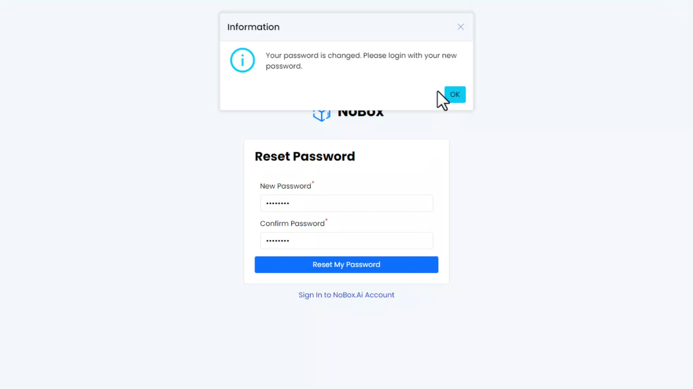

# Lupa Password

Fitur ini dapat membantu anda jika anda lupa password saat login website id.nobox.ai caranya sebagai berikut :

<iframe width="742" height="418" src="https://www.youtube.com/embed/jdv8A8J8cdk" title="Pengenalan Tampilan NoBox" frameborder="0" allow="accelerometer; autoplay; clipboard-write; encrypted-media; gyroscope; picture-in-picture; web-share" referrerpolicy="strict-origin-when-cross-origin" allowfullscreen></iframe>

1\. Klik **\[Lupa Password]** pada halaman login **➔** isi alamat email Anda dan ceklis recaptcha.

2\. Klik **\[Reset Password Saya]** maka akan tampil notifikasi pengaturan ulang kata sandi yang akan dikirimkan melalui email Anda.

<figure><figcaption></figcaption></figure>

3\. Cek inbox email Anda dan klik link maka akan langsung diarahkan menuju halaman reset password.

<figure><figcaption></figcaption></figure>

4\. Masukkan kata sandi baru dan konfirmasi password dengan mengisi ulang kata sandi di kolom confirm password.

5\. Klik **\[Reset Password saya]** maka akan tampil pop up bahwa kata sandi Anda telah berhasil diubah.

<figure><figcaption></figcaption></figure>

6\. Klik **\[OK]** untuk ke halaman login website id.nobox.ai

7\. Silahkan login dengan kata sandi baru Anda.

Jika ada masalah atau kesulitan terkait NoBox, silahkan hubungi kami melalui [Support Ticket](https://crm.nobox.ai/clients/tickets)
