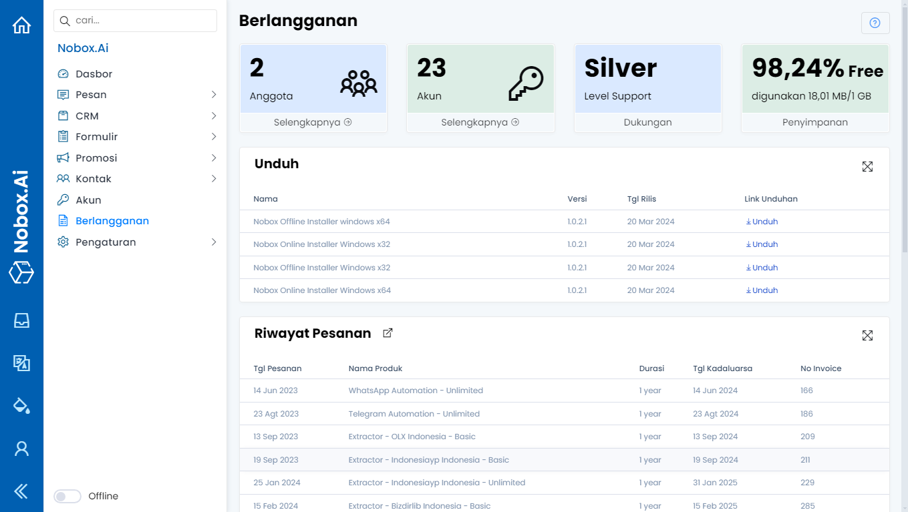

# Berlangganan

Berlangganan adalah ringkasan informasi riwayat pesanan produk dan total kuota yang digunakan.

<iframe width="742" height="418" src="https://www.youtube.com/embed/ZSXNzmvrxt4" title="Pengenalan Tampilan NoBox" frameborder="0" allow="accelerometer; autoplay; clipboard-write; encrypted-media; gyroscope; picture-in-picture; web-share" referrerpolicy="strict-origin-when-cross-origin" allowfullscreen></iframe>

<figure><figcaption></figcaption></figure>

Pada tampilan tersebut, terdapat beberapa bagian yang mempunyai fungsi masing-masing. Penjelasan dari fungsi tersebut adalah sebagai berikut :

<table><thead><tr><th width="169.20001220703125">Fitur/Tombol</th><th>Fungsi</th></tr></thead><tbody><tr><td>Anggota</td><td>Total anggota perusahaan</td></tr><tr><td>Akun</td><td>Total data akun </td></tr><tr><td>Dukungan</td><td>Informasi level support</td></tr><tr><td>Penyimpanan</td><td>Informasi persentase sisa penyimpanan dan total penyimpanan yang digunakan</td></tr><tr><td>Unduh</td><td> </td></tr><tr><td>Riwayat Pesanan</td><td>Informasi data pesanan yang telah dibeli</td></tr><tr><td>Kuota</td><td>Informasi kuota ekstrak dan pesan siaran yang dipakai </td></tr><tr><td> </td><td>Digunakan untuk filter data sesuai kanal</td></tr></tbody></table>

***

Jika ada masalah atau kesulitan terkait Nobox.Ai, silahkan hubungi kami melalui [Support Ticket](https://crm.nobox.ai/clients/tickets)
