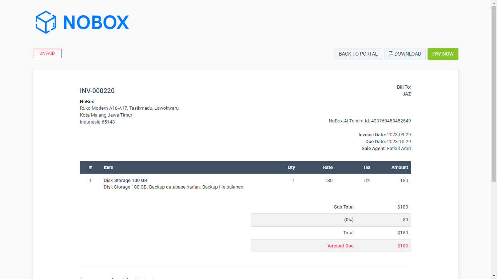
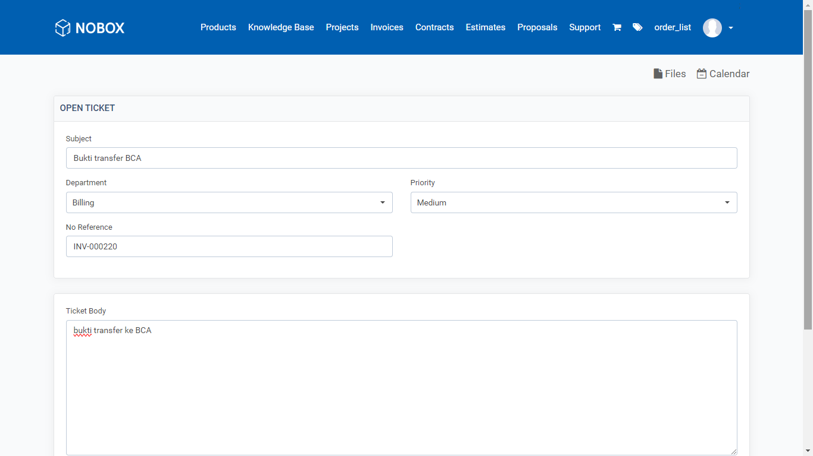
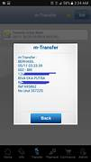

# Billing

<iframe width="742" height="418" src="https://www.youtube.com/embed/0ectimbtruk" title="Pengenalan Tampilan NoBox" frameborder="0" allow="accelerometer; autoplay; clipboard-write; encrypted-media; gyroscope; picture-in-picture; web-share" referrerpolicy="strict-origin-when-cross-origin" allowfullscreen></iframe>

## **Cara Berlangganan**

1\. Silahkan masuk ke menu **\[Product]**, pilih salah satu produk.

2\. Klik **\[Order]** untuk membeli produk tersebut.

3\. Disini akan langsung diarahkan ke invoice pembelian dengan status tagihan yang masih belum terbayar dan informasi pembelian produk.

<figure><figcaption></figcaption></figure>

4\. Pilih metode pembayaran online atau offline (Untuk pembayaran online Akan ada 2 pilihan pembayaran dengan menggunakan paypal smart checkout atau paypal. Untuk pembayaran offline ada 2 pilihan bisa lewat bank BCA atau bank Mandiri).

## **Kirim Bukti Pembayaran Via Transfer Bank**

1\. Klik **\[Back to Portal]** untuk kembali ke menu invoice.

2\. Buka menu support dan klik **\[Open Ticket]**.

3\. Lengkapi isian seperti contoh berikut.

<figure><figcaption></figcaption></figure>

| Isian        | Uraian                 | Contoh                          |
| ------------ | ---------------------- | ------------------------------- |
| Subject      | Nama tagihan           | Bukti transfer BCA              |
| Department   | Pilih jenis tagihan    | Billing                         |
| Priority     | Pilih prioritas        | Medium                          |
| No Reference | Masukkan nomor tagihan | INV-000220                      |
| Ticket Body  | Deskripsi              | bukti transfer ke BCA           |
| Attactments  | Bukti pembayaran       |  |

4\. Klik **\[Save]** maka akan tampil Ticket Information untuk melihat form yang telah di isi.

5\. Setelah Ticket Support dibuat dan sudah terkirim ke admin status berubah menjadi **\[Open]**.

6\. Jika admin sudah merespon status akan berubah menjadi **\[Answered]**.

7\. Jika pembayaran sudah dikonfirmasi status akan berubah menjadi **\[Close]**.

8\. Bisa dicek di menu **\[Invoice]** untuk tagihan tersebut status sudah berubah terbayar dan pastikan di id.nobox.ai bagian menu **\[Subscription]** sudah ada informasi produk yang baru saja anda beli.

***

Jika ada masalah atau kesulitan terkait NoBox, silahkan hubungi kami melalui [Support Ticket](https://crm.mynobox.com/clients/tickets)
