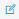

# Perusahaan

Perusahaan adalah salah satu menu pada CRM NoBox.Ai yang digunakan untuk manajemen informasi dan aktivitas yang terkait dengan perusahaan atau bisnis pelanggan.

<iframe width="742" height="418" src="https://www.youtube.com/embed/ike07JFtXtc" title="Pengenalan Tampilan NoBox" frameborder="0" allow="accelerometer; autoplay; clipboard-write; encrypted-media; gyroscope; picture-in-picture; web-share" referrerpolicy="strict-origin-when-cross-origin" allowfullscreen></iframe>

<figure><figcaption></figcaption></figure>

## **Tambah Perusahaan**

Untuk membuat data perusahaan, silahkan Anda klik modul **\[CRM] ➔** klik menu **\[Perusahaan] ➔ \[Perusahaan] ➔ \[Tambah Perusahaan]**. Maka akan tampil dialog **\[Tambah Perusahaan]** kemudian lengkapi isian-isian yang terdapat dalam dialog tersebut.

<figure><figcaption></figcaption></figure>

| Isian     | Uraian               | Contoh           |
| --------- | -------------------- | ---------------- |
| Nama      | Nama perusahaan      | Naysa Collection |
| Pemilik   | Pemilik perusahaan   | INDAHYATI        |
| Gambar    | Gambar perusahaan    | -                |
| Situs Web | Situs web perusahaan | www.nasya.com    |
| Telepon   | Nomor telepon        | 0823569          |
| Negara    | Negara perusahaan    | Indonesia        |
| Provinsi  | Provinsi perusahaan  | Jawa Timur       |
| Kota      | Kota Perusahaan      | Kabupaten Gresik |
| Kode Pos  | Kode pos             | 65165            |
| Alamat    | Alamat Perusahaan    | Jl.Ikan Hiu      |
| Industri  | Jenis Industri       | Pakaian & Model  |
| Sumber    | Sumber               | Website          |
| Tipe      | Tipe Perusahaan      | Partner          |

Jika Anda sudah melengkapi isian-isian yang ada, klik **\[Simpan]** untuk menyimpan data perusahaan yang baru saja Anda buat.

## **Edit dan Hapus Data Perusahaan**

Untuk mengedit suatu data perusahaan, silahkan pilih terlebih dahulu data mana yang akan diedit. Editlah data Anda dan klik **\[Simpan]** untuk menyimpan perubahan tersebut. Untuk menghapus suatu data perusahaan adalah dengan pilih data perusahaan yang akan dihapus, kemudian klik **\[Hapus]**, maka akan tampil dialog konfirmasi apakah Anda ingin menghapus data tersebut. Jika ya, klik **\[Ya]** jika tidak maka klik **\[Tidak]**.

## Log

Log adalah salah satu fitur NoBox.Ai untuk memberikan informasi aktivitas yang berhubungan dengan perusahaan tersebut.

<figure><figcaption></figcaption></figure>

## **Tugas**

Tugas adalah salah satu fitur NoBox.Ai yang digunakan untuk manajemen tugas yang berhubungan dengan perusahaan tersebut.

<figure><figcaption></figcaption></figure>

## **Tambah Data Tugas**

Untuk membuat data tugas, silahkan klik menu **\[Perusahaan]** dan pilih perusahaan yang telah Anda buat. Kemudian klik tab **\[Tugas] ➔ \[Tambah Tugas]**. Maka akan muncul dialog **\[Tambah Tugas]** kemudian lengkapi isian-isian yang ada pada dialog tersebut.

<figure><figcaption></figcaption></figure>

| Isian                    | Uraian                               | Contoh                                                        |
| ------------------------ | ------------------------------------ | ------------------------------------------------------------- |
| Nama                     | Nama Tugas                           | Buat Penawaran Promo ramadan                                  |
| Detail/Rencana           | Rincian/rencana Tugas                | Mendata dan menghubungi pelanggan yang daftar dalam pelatihan |
| Langkah Berikutnya/Hasil | Langkah selanjutnya atau hasil Tugas | Membuat jadwal pelatihan                                      |
| Lampiran                 | Lampiran Tugas                       | -                                                             |
| Pemilik                  | Pilih pemilik Tugas                  | Jasmine                                                       |
| Selesai                  | Ceklist jika tugas sudah selesai     |                                                               |
| List                     | Pilih list Tugas                     | Baru                                                          |
| Kategori                 | Pilih kategori Tugas                 | Promo Besar                                                   |
| Prioritas                | Level prioritas                      | Medium                                                        |
| Tag                      | Tag Tugas                            | Penjualan                                                     |
| Tgl Mulai                | Batas waktu                          | 10-05-2024 13:00                                              |
| Tgl Selesai              | Akhir batas waktu                    | 15-05-2024 15:00                                              |
| Kontak                   | Pilih contact terkait                | Jasmine                                                       |
| Perusahaan               | Pilih company terkait task           | Azahza Collection                                             |
| Transaksi                | Pilih Transaksi                      | Penawaran PT Sentosa                                          |

Jika Anda sudah melengkapi isian-isian yang ada, klik **\[Simpan]** untuk menyimpan data tag yang baru saja Anda buat.

## **Edit dan Hapus Data Tugas**

Untuk mengedit suatu data tugas, silahkan pilih terlebih dahulu data mana yang akan diedit. Editlah data Anda dan klik **\[Simpan]** untuk menyimpan perubahan tersebut. Untuk menghapus suatu data tugas adalah dengan pilih data tugas yang akan dihapus, kemudian klik **\[Hapus]**, maka akan tampil dialog konfirmasi apakah Anda ingin menghapus data tersebut. Jika ya, klik **\[Ya]** jika tidak maka klik **\[Tidak]**.

## Catatan

Catatan adalah salah satu fitur NoBox.Ai yang digunakan untuk menampilkan catatan.

<figure><figcaption></figcaption></figure>

## **Tambah Data Catatan**

Untuk membuat data catatan, Anda dapat mengetikkan langsung di bagian . Jika Anda sudah mengisi catatan, silahkan klik tombol  untuk menyimpan catatan.

## **Edit dan Hapus Data Catatan**

Fitur ini hanya bisa digunakan oleh NoBox.Ai Supervisor, agen hanya bisa menambahkan catatan tetapi tidak bisa mengedit atau menghapus data catatan.

Untuk mengedit suatu data catatan, silahkan klik ikon **\[****]** di bagian samping catatan yang ingin Anda edit. Editlah data tersebut dan klik tombol kirim atau tekan enter pada keyboard Anda untuk menyimpan perubahan tersebut. Untuk menghapus data catatan, silahkan klik ikon \[] di bagian samping catatan yang ingin dihapus. Maka akan muncul dialog konfirmasi apakah Anda ingin menghapus catatan tersebut. Jika ya, klik **\[Ya]** jika tidak maka klik **\[Tidak]**.

---

Jika ada masalah atau kesulitan terkait NoBox.Ai, silahkan hubungi kami melalui [Support Ticket](https://crm.nobox.ai/clients/tickets)
