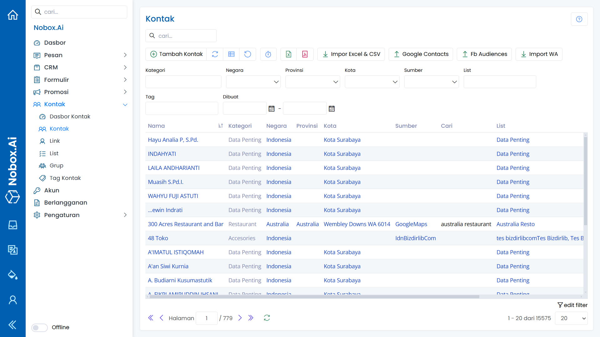
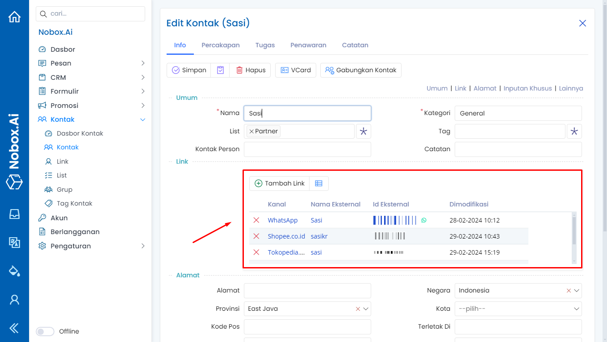
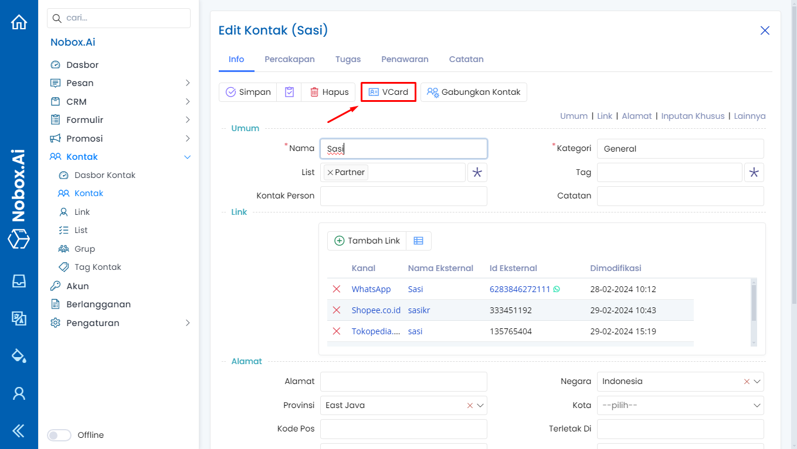
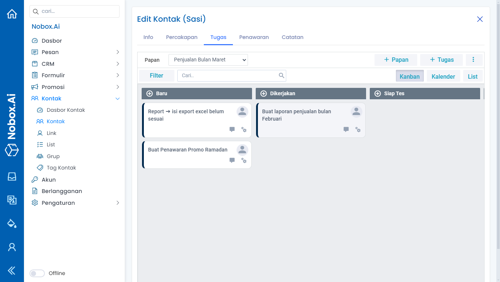
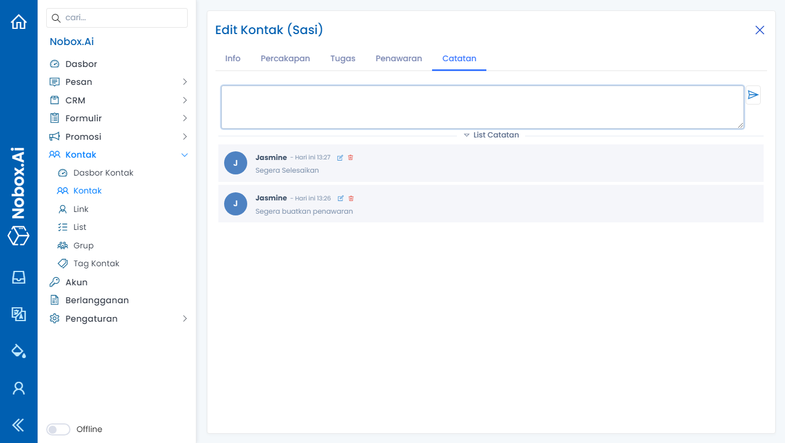

# Kontak

Kontak adalah salah satu menu pada Nobox.Ai yang digunakan untuk menampung data kontak hasil ekstraksi dan menangani data target promosi.

<iframe width="742" height="418" src="https://www.youtube.com/embed/3EXx7AMWzwg" title="Pengenalan Tampilan NoBox" frameborder="0" allow="accelerometer; autoplay; clipboard-write; encrypted-media; gyroscope; picture-in-picture; web-share" referrerpolicy="strict-origin-when-cross-origin" allowfullscreen></iframe>

<figure><figcaption></figcaption></figure>

Pada tampilan tersebut, terdapat beberapa bagian yang mempunyai fungsi masing-masing. Penjelasan dari fungsi tersebut adalah sebagai berikut :

**• Impor Excel & CSV** : Digunakan untuk impor data kontak dengan format excel atau CSV dari file yang Anda miliki ke data kontak Nobox.Ai Anda.

## **Cara Impor Excel & CSV**

1\. Buka menu **\[Kontak]** **➔** klik fitur **\[Impor Excel & CSV]**.

<figure><figcaption></figcaption></figure>

2\. Kemudian \[Unduh Model] terlebih dahulu atau upload excel atau CSV yang sudah Anda punya. Klik **\[Pilih File]** **➔** pilih file excel atau CSV Anda, kemudian klik **\[Impor]**.

<figure><figcaption></figcaption></figure>

3\. Maka akan tampil dialog **\[Impor Excel & CSV].** Lengkapi isian kanal, list, negara, kategori, tag.

<figure><figcaption></figcaption></figure>

Kemudian mapping data excel dengan field di Nobox.Ai dilakukan dengan cara memilih nama field yang sesuai dengan nama kolom pada data Excel.

Pastikan Anda memilih field **\[ID Eksternal]** untuk semua data seperti nomor telepon, email, dan lainnya. Setelah itu, klik tombol **\[Simpan]** untuk menyimpan data.

<figure><figcaption></figcaption></figure>

**• Google Kontak** : Digunakan untuk download data kontak berupa CSV yang memudahkan Anda untuk impor data kontak ke Google Kontak.

## **Cara Export Google Kontak**

1\. Klik fitur **\[Google Contacts]**, maka akan otomatis download data kontak Anda.

<figure><figcaption></figcaption></figure>

2\. Buka Google Kontak di akun google Anda, lalu klik **\[Impor kontak]**.

<figure><figcaption></figcaption></figure>

3\. Pilih file yang sudah didownload dari Nobox.Ai, lalu klik **\[Impor]**.

<figure><figcaption></figcaption></figure>

4\. Maka akan tampil data tersebut, pilih data dan klik ikon  untuk menambahkan kontak pada akun google Anda.

<figure><figcaption></figcaption></figure>

**• Fb Audiences** : Digunakan untuk download data kontak berupa excel atau CSV yang memudahkan Anda untuk impor data kontak ke facebook audiences.

<figure><figcaption></figcaption></figure>

## **Tambah Kontak**

Untuk menambah data kontak, silahkan klik menu **\[Kontak]**➔**\[Tambah Kontak]**. Maka akan tampil dialog **\[Tambah Kontak].** Kemudian lengkapi isian-isian yang terdapat pada dialog tersebut.

<figure><figcaption></figcaption></figure>

| Isian         | Uraian                                | Contoh                        |
| ------------- | ------------------------------------- | ----------------------------- |
| Nama          | Nama kontak                           | Erik Setiadi                  |
| Kategori      | Kategori                              | General                       |
| List          | Isi list                              | Partner                       |
| Tag           | Isi tag                               | Pelanggan Prioritas           |
| Kontak Person | Nama orang yang terkait dengan kontak | -                             |
| Catatan       | Catatan kontak                        | -                             |
| Link          | Akun-akun kontak                      | Email, WhatsApp, Shopee.co.id |
| Alamat        | Alamat kontak                         | Jl. Akordion                  |
| Negara        | Pilih negara                          | Indonesia                     |
| Provinsi      | Pilih provinsi                        | Jawa Timur                    |
| Kota          | Pilih kota                            | Malang                        |
| Pos           | Isi kode pos                          | 65124                         |

Jika Anda sudah melengkapi isian yang ada, klik **\[Simpan]** untuk menyimpan data kontak yang baru saja Anda buat.

## **Link**

Link digunakan untuk menampung akun-akun kontak tersebut. Seperti nomer WhatsApp, Email, Telegram, dsb.

<figure><figcaption></figcaption></figure>

## **Tambah Link**

Untuk tambah data link, silahkan klik **\[Tambah Link]** maka akan tampil dialog **\[Tambah Link].** Kemudian lengkapi isian pada dialog tersebut.

<figure><figcaption></figcaption></figure>

| Isian          | Uraian                                                               | Contoh         |
| -------------- | -------------------------------------------------------------------- | -------------- |
| Kanal          | Pilih kanal                                                          | Email          |
| Nama Eksternal | Nama eksternal link                                                  | Sasi Email     |
| Id Eksternal   | Isi dengan dengan no telp, id shopee dll sesuai dengan pilihan kanal | sasi@gmail.com |
| Id Percakapan  | Id percakapan                                                        | -              |
| Foto           | Isi url foto                                                         | -              |
| Tambahan       | Isi keterangan tambahan                                              | -              |

Jika Anda sudah melengkapi isian yang ada, klik **\[Simpan]** untuk menyimpan data link yang baru saja Anda buat.

## **Edit Dan Hapus Data Link**

Untuk mengedit suatu data link, silahkan pilih terlebih dahulu data mana yang akan diedit. Editlah data Anda dan klik **\[Simpan]** untuk menyimpan perubahan tersebut.

Untuk menghapus suatu data link adalah dengan pilih data mana yang akan dihapus, kemudian klik **\[Hapus]**, maka akan tampil dialog konfirmasi apakah Anda ingin menghapus data. Jika ya, klik **\[Ya]** jika tidak maka klik **\[Tidak]**.

## **vCard**

vCard adalah fitur yang memungkinkan Anda mengirim informasi kontak dalam format yang bisa dengan mudah dibaca di program email lainnya, vCard disimpan sebagai file .vcf.

<figure><figcaption></figcaption></figure>

## **Gabung Kontak**

Fitur yang berguna dalam manajemen kontak untuk menghindari duplikasi dan memastikan data yang bersih dan terorganisir, meminimalkan kekacauan dan meningkatkan efisiensi dalam mengelola daftar kontak.

<figure><figcaption></figcaption></figure>

## **Percakapan**

Percakapan adalah tab yang digunakan untuk menampung semua percakapan dengan kontak yang terkait dari percakapan yang statusnya baru, proses, dan selesai. Jadi semua percakapan yang belum terarsip akan termonitoring dengan kontak yang terhubung.

<figure><figcaption></figcaption></figure>

## **Tugas**

Tugas adalah tab yang digunakan untuk manajemen tugas yang berhubungan dengan kontak tersebut.

<figure><figcaption></figcaption></figure>

## **Tambah Tugas**

Untuk tambah data tugas, silahkan klik **\[****]** maka akan tampil dialog **\[Tambah Tugas].** Kemudian lengkapi isian pada dialog tersebut.

<figure><figcaption></figcaption></figure>

Lengkapi isian yang diperlukan, sebagai contoh seperti berikut :

| Isian                    | Uraian                                       | Contoh                                               |
| ------------------------ | -------------------------------------------- | ---------------------------------------------------- |
| Nama                     | Nama tugas                                   | Kirim pesan promosi                                  |
| Detail/Rencana           | Rincian atau rencana tugas                   | Kirim broadcast ke setiap pelanggan di bulan Agustus |
| Langkah Berikutnya/Hasil | Langkah selanjutnya atau hasil tugas         | Rekap data bulanan                                   |
| Lampiran                 | Lampiran tugas                               | -                                                    |
| Pemilik                  | Pemilik tugas                                | Wulan Septi                                          |
| List                     | List tugas                                   | Backlog                                              |
| Kategori                 | Kategori tugas                               | Promosi                                              |
| Prioritas                | Level prioritas                              | Urgent                                               |
| Tag                      | Tag tugas                                    | Promosi, Marketing                                   |
| Tanggal Mulai            | Awal batas waktu                             | 02-08-2023                                           |
| Tanggal Selesai          | Akhir batas waktu                            | 07-08-2023                                           |
| Kontak                   | Kontak yang mengerjakan tugas tersebut       | Wara                                                 |
| Perusahaan               | Perusahaan yang mengerjakan tugas tersebut   | PT. Indodrink                                        |
| Transaksi                | Penawaran yang terkait dengan tugas tersebut | Penawaran Wara Indodrink                             |

Jika Anda sudah melengkapi isian yang ada, klik **\[Simpan]** untuk menyimpan data tugas yang baru saja Anda buat.

## **Edit Dan Hapus Data Tugas**

Untuk mengedit suatu data tugas, silahkan pilih terlebih dahulu data mana yang akan diedit. Editlah data Anda dan klik **\[Simpan]** untuk menyimpan perubahan tersebut.

Untuk menghapus suatu data tugas adalah dengan pilih data mana yang akan dihapus, kemudian klik **\[Hapus]**, maka akan tampil dialog konfirmasi apakah Anda ingin menghapus data tersebut. Jika ya, klik **\[Ya]** jika tidak maka klik **\[Tidak]**.

## **Penawaran**

Penawaran adalah tab yang digunakan untuk manajemen penawaran yang bersangkutan dengan kontak tersebut.

<figure><figcaption></figcaption></figure>

## **Tambah Penawaran**

Untuk tambah data penawaran, silahkan klik **\[****]** maka akan tampil dialog **\[Tambah Penawaran].** Kemudian lengkapi isian pada dialog tersebut.

<figure><figcaption></figcaption></figure>

Lengkapi isian yang diperlukan, sebagai contoh seperti berikut :

| Isian              | Uraian                  | Contoh                        |
| ------------------ | ----------------------- | ----------------------------- |
| Nama Penawaran     | Nama kesepakatan        | Penawaran Gamis Zeyaa         |
| Harga              | Harga kesepakatan       | Rp 1.000.000                  |
| Tugaskan Ke        | Ditugaskan kepada       | Jasmine                       |
| Tanggal Tutup      | Tanggal tutup           | 07-12-2024                    |
| Sumber             | Pencarian               | Other                         |
| Alasan Gagal       | Alasan gagal penawaran  | -                             |
| Papan              | Pilihan papan           | Penawaran Bulan November 2024 |
| Tahapan            | Tahapan                 | Sedang                        |
| Tanggal Mulai      | Tanggal mulai           | 03-12-2024                    |
| Tanggal Kadaluarsa | Tanggal kadaluarsa      | 10-12-2024                    |
| Prioritas          | Level Prioritas         | Sedang                        |
| Perusahaan         | Perusahaan kesepakatan  | PT. Puspita                   |
| Kontak             | List kontak terkait     | Sasi                          |
| Produk             | List produk             | Gamis Zeyaa                   |

Jika Anda sudah melengkapi isian yang ada, klik **\[Simpan]** untuk menyimpan data penawaran yang baru saja Anda buat.

## **Edit Dan Hapus Data Penawaran**

Untuk mengedit suatu data penawaran, silahkan pilih terlebih dahulu data mana yang akan diedit. Editlah data Anda dan klik **\[Simpan]** untuk menyimpan perubahan tersebut.

Untuk menghapus suatu data penawaran adalah dengan pilih data mana yang akan dihapus, kemudian klik **\[Hapus]**, maka akan tampil dialog konfirmasi apakah Anda ingin menghapus data tersebut. Jika ya, klik **\[Ya]** jika tidak maka klik **\[Tidak]**.

## **Catatan**

Catatan adalah salah satu fitur Nobox.Ai yang digunakan untuk membuat catatan terkait data kontak tersebut.

<figure><figcaption></figcaption></figure>

## **Tambah Data Catatan**

Untuk membuat data catatan, Anda dapat mengetikkan langsung di bagian . Jika Anda sudah mengisi catatan, silahkan klik tombol  untuk menyimpan catatan.

## **Edit dan Hapus Data Catatan**

Fitur ini hanya bisa digunakan oleh NoBox Supervisor, agen hanya bisa menambahkan catatan tetapi tidak bisa mengedit atau menghapus data catatan.

Untuk mengedit suatu data catatan, silahkan klik ikon **\[****]** di bagian samping catatan yang ingin Anda edit. Editlah data tersebut dan klik tombol kirim atau tekan enter pada keyboard Anda untuk menyimpan perubahan tersebut.

Untuk menghapus data catatan, silahkan klik ikon \[] di bagian samping catatan yang ingin dihapus. Maka akan muncul dialog konfirmasi apakah Anda ingin menghapus catatan tersebut. Jika ya, klik **\[Ya]** jika tidak maka klik **\[Tidak]**.

## **Edit dan Hapus Data Kontak**

Untuk mengedit suatu data kontak, silahkan pilih terlebih dahulu data mana yang akan diedit. Editlah data Anda dan klik **\[Simpan]** untuk menyimpan perubahan tersebut.

Untuk menghapus suatu data kontak adalah dengan pilih data mana yang akan dihapus, kemudian klik **\[Hapus]**, maka akan tampil dialog konfirmasi apakah Anda ingin menghapus data. Jika ya, klik **\[Ya]** jika tidak maka klik **\[Tidak]**.

***

Jika ada masalah atau kesulitan terkait Nobox.Ai, silahkan hubungi kami melalui [Support Ticket](https://crm.nobox.ai/clients/tickets)
