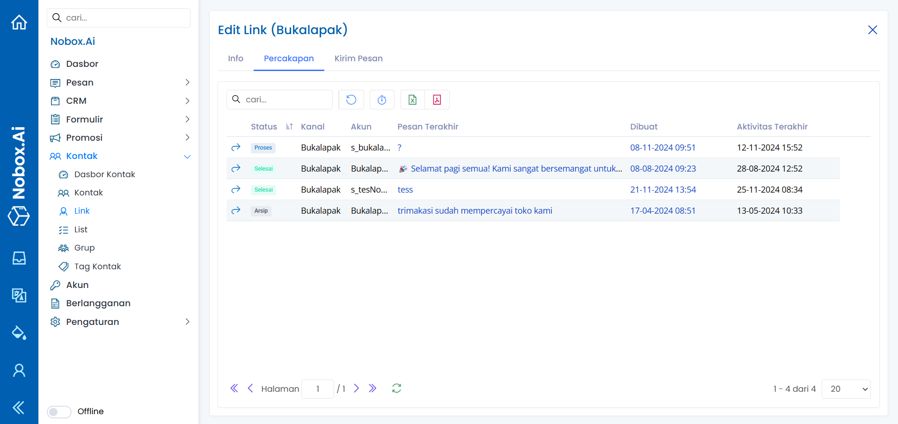
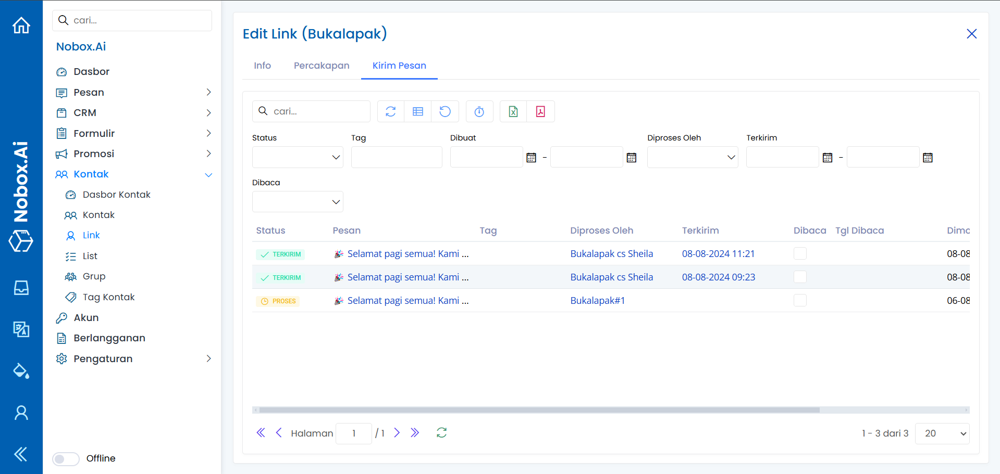

# Link

Link adalah salah satu menu Nobox.Ai yang digunakan untuk menampung akun-akun kontak seperti nomer WhatsApp, Email, Telegram dsb.

<iframe width="742" height="418" src="https://www.youtube.com/embed/DFfvAKB75RY" title="Pengenalan Tampilan NoBox" frameborder="0" allow="accelerometer; autoplay; clipboard-write; encrypted-media; gyroscope; picture-in-picture; web-share" referrerpolicy="strict-origin-when-cross-origin" allowfullscreen></iframe>

<figure><figcaption></figcaption></figure>

## **Tambah Link**

Untuk tambah data link, silahkan klik modul \[Kontak], lalu klik menu **\[Link]**➔**\[Tambah Link].** Maka akan tampil dialog **\[Tambah Link].** Kemudian lengkapi isian pada dialog tersebut.

<figure><figcaption></figcaption></figure>

Jika Anda sudah melengkapi isian yang ada, klik **\[Simpan]** untuk menyimpan data link yang baru saja Anda buat.

## **Edit Dan Hapus Data Link**&#x20;

Untuk mengedit suatu data link, silahkan pilih terlebih dahulu data mana yang akan diedit. Editlah data Anda dan klik **\[Simpan]** untuk menyimpan perubahan tersebut.

Untuk menghapus suatu data link adalah dengan pilih data mana yang akan dihapus, kemudian klik **\[Hapus]**, maka akan tampil dialog konfirmasi apakah Anda ingin menghapus data. Jika ya, klik **\[Ya]** jika tidak maka klik **\[Tidak]**.

## **Percakapan**

Percakapan adalah tab yang digunakan untuk menampung semua percakapan dengan link yang terkait dari percakapan yang statusnya baru, ditugaskan, dan seelsai. Jadi semua percakapan yang belum terarsip akan termonitoring dengan link yang terhubung.

<figure><figcaption></figcaption></figure>

## **Kirim Pesan**

Kirim pesan adalah tab yang digunakan untuk menampung informasi pesan siaran yang dikirim ke link tersebut. Jadi Anda dapat memonitoring hasil pesan siaran yang sudah terkirim, belum terkirim atau gagal terkirim.

<figure><figcaption></figcaption></figure>

***

Jika ada masalah atau kesulitan terkait Nobox.Ai, silahkan hubungi kami melalui [Support Ticket](https://crm.nobox.ai/clients/tickets)
