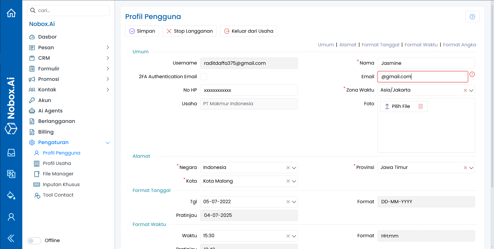

# Profil Pengguna

Profil Pengguna adalah salah satu menu Nobox.Ai yang berisi informasi tentang data diri Anda dan digunakan untuk pengaturan format tanggal,waktu dan angka.

<figure><figcaption></figcaption></figure>

Item-item pada tampilan dan fungsinya, antara lain :

**1. Umum**

Informasi terkait dengan data pengguna.

**2. Alamat**

Alamat pengguna.

**3. Format Tanggal**

Pengaturan format tanggal.

**4. Format Waktu**

Pengaturan format waktu.

**5. Format Angka**

Pengaturan format angka.

Jika Anda melakukan perubahan pada data profil usaha, klik **\[Simpan]** untuk menyimpan data yang baru saja diubah.

***

Jika ada masalah atau kesulitan terkait Nobox.Ai, silahkan hubungi kami melalui [Support Ticket](https://crm.nobox.ai/clients/tickets)

\
