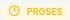
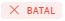

# Kirim Pesan

Kirim Pesan adalah salah satu menu pada Nobox.Ai yang digunakan untuk monitoring hasil kirim pesan dari semua data promosi. Jadi Anda dapat mengetahui hasil kirim pesan yang masih dalam antrian, proses, gagal dan sudah terkirim.

<iframe width="742" height="418" src="https://www.youtube.com/embed/EkWgwRnDC2E/" title="01. Instalasi NoBox Desktop" frameborder="0" allow="accelerometer; autoplay; clipboard-write; encrypted-media; gyroscope; picture-in-picture; web-share" referrerpolicy="strict-origin-when-cross-origin" allowfullscreen></iframe>

<figure><figcaption></figcaption></figure>

<table><thead><tr><th width="133.20001220703125">Fitur/Tombol</th><th>Fungsi</th></tr></thead><tbody><tr><td></td><td> Status dalam antrean data kirim pesan masih belum diproses</td></tr><tr><td></td><td> Status proses data kirim pesan dalam proses pengiriman</td></tr><tr><td></td><td> Status terkirim data kirim pesan sudah terkirim</td></tr><tr><td></td><td> Status gagal data kirim pesan gagal dikirim </td></tr></tbody></table>

Untuk melihat detail data tersebut, dapat Anda lakukan dengan cara klik salah satu data pada kolom pesan, maka akan tampil detail data kirim pesan yang Anda pilih.

---

Jika ada masalah atau kesulitan terkait Nobox.Ai, silahkan hubungi kami melalui [Support Ticket](https://crm.nobox.ai/clients/tickets)
