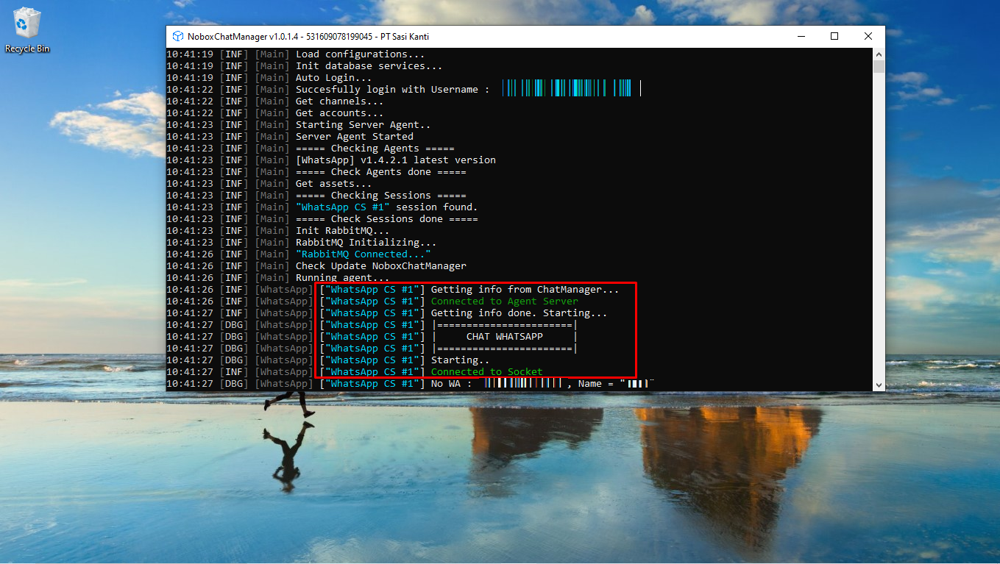

# Instalasi NoBox Web

Kunjungi website NoBox dan masuk menggunakan akun Anda, pastikan Anda sudah memiliki akun yang terdaftar. Pilih menu **\[Berlangganan]**, unduh installer yang sesuai dengan sistem operasi komputer Anda.

<figure><figcaption></figcaption></figure>

Jalankan installer NoBox yang telah diunduh. Pilih server yang ingin Anda gunakan, kemudian masukkan username dan password yang sesuai dengan akun yang terdaftar di website NoBox. Selanjutnya, ikuti langkah-langkah instalasinya.

<figure><figcaption></figcaption></figure>

Jika instalasi berhasil, maka di lokasi yang Anda pilih akan muncul 2 folder: **NoboxChatManager** dan **NoboxChatSession.**

## **Nobox Chat Manager**

Digunakan untuk mengintegrasikan chat web, media sosial, dan pesan instan pada akun automation guna mempermudah mengelola interaksi pelanggan dan prospek bisnis. Untuk menjalankan aplikasi **NoBox Chat Manager**, ikuti langkah-langkah berikut:

* Pertama, buka folder tempat Anda menginstal aplikasi NoBox. Folder ini biasanya terletak di lokasi yang Anda pilih saat instalasi
* Pilih folder **NoboxChatManager,** buka folder yang bernama **\[Bin]** dan jalankan file **NoboxChatManager.exe**

<figure><figcaption></figcaption></figure>

Bisa Anda coba membuat akun dan memastikan apakah akun tersebut berhasil disambungkan dengan memeriksa pada NoboxChatManager, apakah terdapat informasi bahwa Agent sedang berjalan.

<figure><figcaption></figcaption></figure>

Jika Anda belum memahami langkah dasar pembuatan akun, Anda dapat mengikuti panduan berikut :

* [WhatsApp Automation](../automation/whatsapp.md)
* [Telegram Automation](../automation/telegram.md)
* [Shopee Automation](../automation/shopee.md)

## **Nobox Chat Session**

Digunakan untuk manajemen proses login akun contoh seperti tokopedia, telegram, shopee dsb.

* Pertama, buka folder tempat Anda menginstal aplikasi NoBox. Folder ini biasanya terletak di lokasi yang Anda pilih saat instalasi
* Pilih folder **NoboxChatSession,** buka folder yang bernama **\[Bin]** dan jalankan file **NoboxChatSession.exe**

<figure><figcaption></figcaption></figure>
