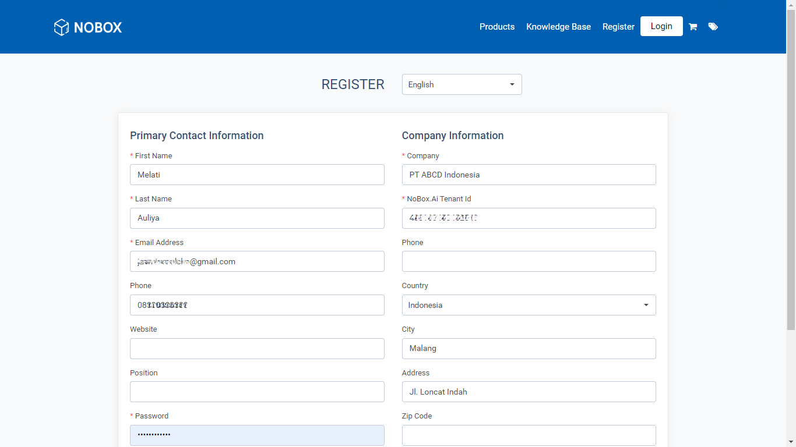
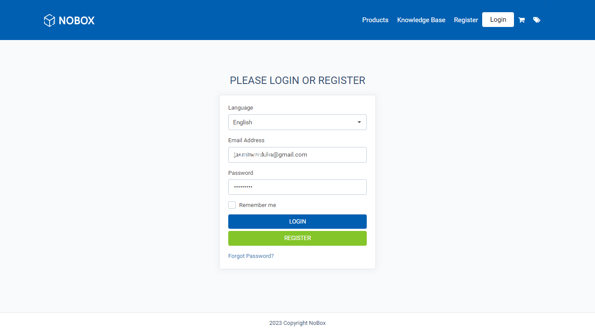

# Registrasi User CRM

<iframe width="742" height="418" src="https://www.youtube.com/embed/0ectimbtruk" title="Pengenalan Tampilan NoBox" frameborder="0" allow="accelerometer; autoplay; clipboard-write; encrypted-media; gyroscope; picture-in-picture; web-share" referrerpolicy="strict-origin-when-cross-origin" allowfullscreen></iframe>

1\. Buka website [crm.nobox.ai](https://crm.nobox.ai/)

2\. Masuk dengan akun yang sudah ada atau daftar akun terlebih dahulu dengan cara klik **\[Register]**.

3\. Masukkan Name, Email Address, Password, Company Information, dan klik **\[Register]**.

<figure><figcaption></figcaption></figure>

4\. Setelah itu akan tampil notifikasi yang menunjukkan bahwa verifikasi akun sudah dikirim melalui email.

5\. Masuk ke dalam inbox email, lalu klik link untuk verifikasi maka akan langsung diarahkan menuju halaman login dari website CRM NoBox.Ai

6\. Kemudian masukkan Email dan Password yang sudah didaftarkan maka akan langsung menuju halaman utama dari CRM NoBox.Ai

<figure><figcaption></figcaption></figure>

Untuk langkah-langkah berlangganan sebagai berikut [Cara Berlangganan](../menu/berlangganan.md)

***

Jika ada masalah atau kesulitan terkait NoBox, silahkan hubungi kami melalui [Support Ticket](https://crm.mynobox.com/clients/tickets)
